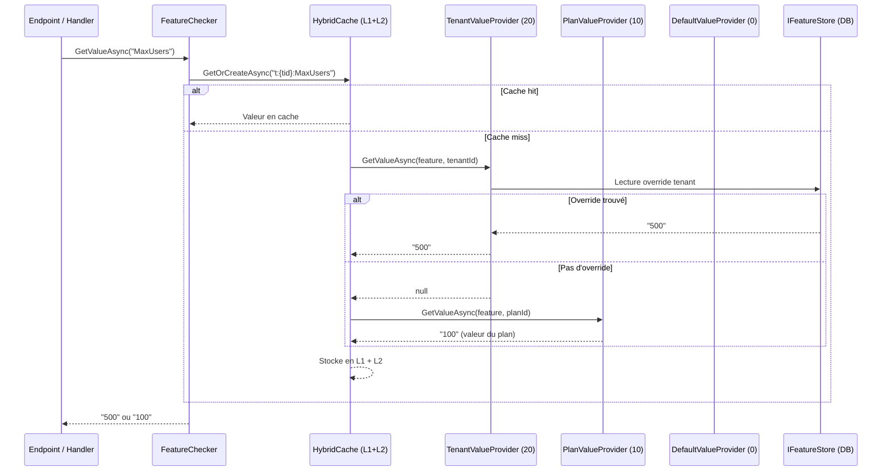

# Feature Flags / SaaS Tiering

## Définition

Le pattern Feature Flags permet d'activer ou désactiver des fonctionnalités à
l'exécution sans redéploiement. Granit étend ce pattern pour le SaaS tiering :
la résolution d'une feature suit une cascade multi-niveaux
**Tenant → Plan → Default**, avec un cache hybride L1/L2 pour la performance.

Trois types de features sont supportés :

- **Toggle** : activé/désactivé (booléen)
- **Numeric** : valeur numérique avec contraintes min/max (quotas SaaS)
- **Selection** : valeur parmi un ensemble de choix autorisés

## Schéma



## Implémentation dans Granit

### Définition des features (code-first)

| Composant | Fichier | Rôle |
|-----------|---------|------|
| `FeatureDefinition` | `src/Granit.Features/Definitions/FeatureDefinition.cs` | Nom, valeur par défaut, type, contraintes |
| `FeatureDefinitionProvider` | `src/Granit.Features/Definitions/FeatureDefinitionProvider.cs` | Classe abstraite à implémenter par l'application |
| `FeatureDefinitionStore` | `src/Granit.Features/Definitions/FeatureDefinitionStore.cs` | Registre singleton agrégeant tous les providers |
| `FeatureGroupDefinition` | `src/Granit.Features/Definitions/FeatureGroupDefinition.cs` | Groupement logique de features |

### Résolution multi-niveaux

| Provider | Ordre | Fichier | Source |
|----------|-------|---------|--------|
| `TenantFeatureValueProvider` | 20 | `src/Granit.Features/ValueProviders/TenantFeatureValueProvider.cs` | `IFeatureStore` (DB) |
| `PlanFeatureValueProvider` | 10 | `src/Granit.Features/ValueProviders/PlanFeatureValueProvider.cs` | `IPlanFeatureStore` (application) |
| `DefaultValueFeatureValueProvider` | 0 | `src/Granit.Features/ValueProviders/DefaultValueFeatureValueProvider.cs` | `FeatureDefinition.DefaultValue` (code) |

### Cache et invalidation

| Composant | Fichier | Rôle |
|-----------|---------|------|
| `FeatureChecker` | `src/Granit.Features/Checker/FeatureChecker.cs` | Orchestration résolution + `HybridCache` |
| `FeatureCacheKey` | `src/Granit.Features/Cache/FeatureCacheKey.cs` | Format : `t:{tenantId}:{featureName}` |
| `FeatureCacheInvalidationHandler` | `src/Granit.Features/Cache/FeatureCacheInvalidationHandler.cs` | Écoute `FeatureValueChangedEvent`, purge le cache |

### Garde de limites numériques

| Composant | Fichier | Rôle |
|-----------|---------|------|
| `IFeatureLimitGuard` | `src/Granit.Features/Limits/IFeatureLimitGuard.cs` | `CheckAsync(feature, currentCount)` — lève `FeatureLimitExceededException` |
| `FeatureLimitGuard` | `src/Granit.Features/Limits/FeatureLimitGuard.cs` | Implémentation |

### Intégration ASP.NET Core + Wolverine

| Composant | Fichier | Rôle |
|-----------|---------|------|
| `[RequiresFeature]` | `src/Granit.Features/AspNetCore/RequiresFeatureAttribute.cs` | Attribut sur actions/endpoints |
| `RequiresFeatureFilter` | `src/Granit.Features/AspNetCore/RequiresFeatureFilter.cs` | `IAsyncActionFilter` MVC |
| `RequiresFeatureEndpointFilter` | `src/Granit.Features/AspNetCore/RequiresFeatureEndpointFilter.cs` | Minimal API filter |
| `RequiresFeatureMiddleware` | `src/Granit.Features/Wolverine/RequiresFeatureMiddleware.cs` | Wolverine handler middleware |

## Justification

| Problème | Solution |
|----------|----------|
| Plans SaaS différents (Free/Pro/Enterprise) avec des limites | `Numeric` features avec `NumericConstraint` + `FeatureLimitGuard` |
| Override par tenant sans redéployer | `TenantFeatureValueProvider` lit les overrides en DB |
| Performance : la résolution ne doit pas appeler la DB à chaque requête | `HybridCache` L1 (in-memory) + L2 (Redis) avec invalidation événementielle |
| Cohérence multi-instance : un changement de feature doit être visible partout | `FeatureValueChangedEvent` purge le cache L1 et L2 via Wolverine |
| Protection API : bloquer l'accès si la feature est désactivée | `[RequiresFeature]` sur MVC, Minimal API et handlers Wolverine |

## Exemple d'usage

```csharp
// 1. Définir les features (code-first)
public sealed class AcmeFeatureDefinitionProvider : FeatureDefinitionProvider
{
    public override void Define(IFeatureDefinitionContext context)
    {
        FeatureGroupDefinition group = context.AddGroup("Acme");

        group.AddFeature("Acme.MaxUsers",
            defaultValue: "50",
            valueType: FeatureValueType.Numeric,
            numericConstraint: new NumericConstraint(Min: 1, Max: 10_000));

        group.AddFeature("Acme.Telehealth",
            defaultValue: "false",
            valueType: FeatureValueType.Toggle);
    }
}

// 2. Vérifier dans un handler
public static class CreatePatientHandler
{
    public static async Task Handle(
        CreatePatientCommand command,
        IFeatureLimitGuard limitGuard,
        IFeatureChecker features,
        PatientDbContext db,
        CancellationToken cancellationToken)
    {
        // Lève FeatureLimitExceededException si le quota est atteint
        long currentCount = await db.Patients.CountAsync(ct);
        await limitGuard.CheckAsync("Acme.MaxUsers", currentCount, ct);

        // Vérifie qu'une feature toggle est activée
        await features.RequireEnabledAsync("Acme.Telehealth", ct);

        // Logique métier...
    }
}

// 3. Protéger un endpoint
app.MapPost("/api/patients", CreatePatientEndpoint.Handle)
    .RequiresFeature("Acme.MaxUsers");
```
