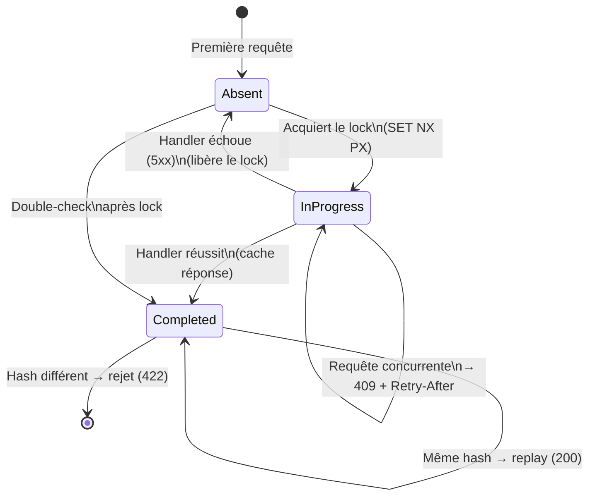

# Idempotence HTTP (Stripe-style)

## Définition

L'idempotence garantit qu'une même requête HTTP, rejouée plusieurs fois,
produit toujours le même résultat sans effets de bord supplémentaires. Le
client envoie un header `Idempotency-Key` ; le serveur associe ce clé à la
réponse et la rejoue en cas de retry.

Granit implémente une variante inspirée de l'API Stripe avec une
**machine à états** (Absent → InProgress → Completed), un hash SHA-256 du
payload pour détecter les mutations, et un store Redis multi-tenant.

## Schéma



## Implémentation dans Granit

| Composant | Fichier | Rôle |
|-----------|---------|------|
| `IdempotencyMiddleware` | `src/Granit.Idempotency/Internal/IdempotencyMiddleware.cs` | Middleware ASP.NET Core — machine à états complète |
| `IdempotencyState` | `src/Granit.Idempotency/Models/IdempotencyState.cs` | Enum : `Absent`, `InProgress`, `Completed` |
| `[Idempotent]` | `src/Granit.Idempotency/Attributes/IdempotentAttribute.cs` | Attribut marqueur sur les endpoints |
| `RedisIdempotencyStore` | `src/Granit.Idempotency/Redis/RedisIdempotencyStore.cs` | Store Redis avec TTL configurable |
| `IIdempotencyMetadata` | `src/Granit.Idempotency/Abstractions/IIdempotencyMetadata.cs` | Interface marqueur pour les endpoints |

### Algorithme détaillé

1. Extraction du header `Idempotency-Key`
2. Calcul du hash SHA-256 : `METHOD + route + key + body` (zero-allocation
   via `IncrementalHash` + `ArrayPool`)
3. Clé Redis composite : `idempotency:{tenantId}:{userId}:{key}`
4. Vérification de l'état :
   - **Absent** → tente `SET NX PX` (lock avec TTL)
   - **InProgress** → retourne `409 Conflict` + header `Retry-After`
   - **Completed** + même hash → replay de la réponse (status + headers + body)
   - **Completed** + hash différent → retourne `422 Unprocessable Entity`
5. Après exécution réussie : stocke la réponse complète
6. Après échec (5xx) : libère le lock (permet le retry)

### Variantes maison

- **Clé composite multi-tenant** : inclut `tenantId` + `userId` pour
  l'isolation
- **Hash zero-allocation** : `IncrementalHash.CreateHash(HashAlgorithmName.SHA256)`
  + `ArrayPool<byte>.Shared` pour le streaming du body
- **Double-check locking** : vérifie le cache avant ET après l'acquisition
  du lock

## Justification

| Problème | Solution |
|----------|----------|
| Retry réseau crée des doublons (double paiement, double création) | La clé d'idempotence détecte et rejoue les requêtes déjà traitées |
| Requêtes concurrentes avec la même clé | State `InProgress` retourne 409 — le client attend et retente |
| Mutation du payload entre deux envois | Le hash SHA-256 détecte la différence → 422 |
| Performance : pas de lock sur les requêtes normales (sans clé) | Le middleware court-circuite immédiatement si pas de header |
| Multi-tenant : une clé d'un tenant ne doit pas impacter un autre | Clé Redis préfixée par `{tenantId}:{userId}` |

## Exemple d'usage

```csharp
// Marquer un endpoint comme idempotent
app.MapPost("/api/invoices", async (
    CreateInvoiceRequest request,
    InvoiceService service,
    CancellationToken ct) =>
{
    InvoiceDto invoice = await service.CreateAsync(request, ct);
    return Results.Created($"/api/invoices/{invoice.Id}", invoice);
})
.WithMetadata(new IdempotentAttribute());

// Le client envoie :
// POST /api/invoices
// Idempotency-Key: 550e8400-e29b-41d4-a716-446655440000
// Content-Type: application/json
// { "patientId": "...", "amount": 150.00 }

// Premier appel → 201 Created (résultat stocké)
// Deuxième appel (même clé, même body) → 201 Created (replay)
// Deuxième appel (même clé, body modifié) → 422 Unprocessable Entity
```
