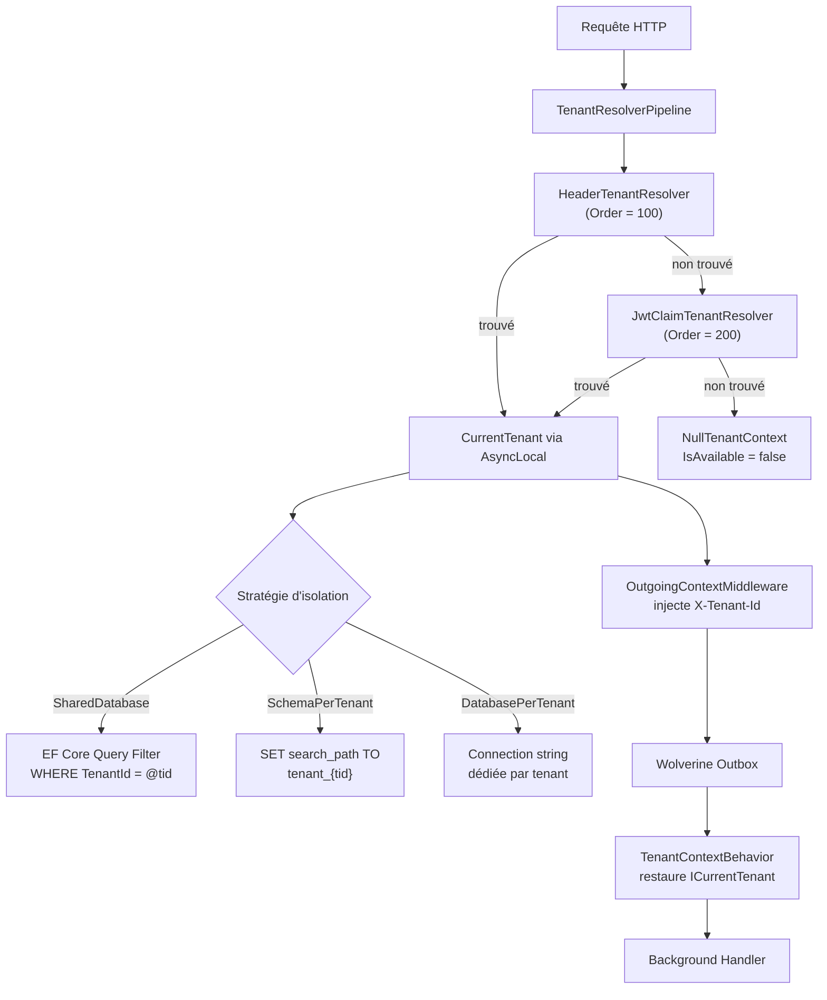

# Multi-Tenancy

## Définition

Le multi-tenancy permet à une même instance applicative de servir plusieurs
organisations (tenants) avec une isolation stricte des données. Chaque requête
est associée à un tenant via un pipeline de résolution, et cette information
circule à travers toutes les couches — y compris les traitements asynchrones
Wolverine.

Granit implémente trois stratégies d'isolation et un mécanisme de
**soft dependency** : `ICurrentTenant` est disponible dans tous les modules
sans dépendance directe vers `Granit.MultiTenancy`.

## Schéma



## Implémentation dans Granit

### Soft dependency (`Granit.Core`)

| Composant | Fichier | Rôle |
|-----------|---------|------|
| `ICurrentTenant` | `src/Granit.Core/MultiTenancy/ICurrentTenant.cs` | Interface minimale : `Id`, `IsAvailable`, `Change()` |
| `NullTenantContext` | `src/Granit.Core/MultiTenancy/NullTenantContext.cs` | Null Object : `IsAvailable = false`, opérations no-op |

Tous les modules résolvent `ICurrentTenant` via `Granit.Core.MultiTenancy` —
aucun `[DependsOn(GranitMultiTenancyModule)]` n'est requis.

### Hard dependency (`Granit.MultiTenancy`)

| Composant | Fichier | Rôle |
|-----------|---------|------|
| `CurrentTenant` | `src/Granit.MultiTenancy/CurrentTenant.cs` | Implémentation `AsyncLocal<TenantInfo?>` + `TenantScope` (IDisposable) |
| `TenantResolverPipeline` | `src/Granit.MultiTenancy/Pipeline/TenantResolverPipeline.cs` | Chaîne ordonnée de `ITenantResolver` |
| `HeaderTenantResolver` | `src/Granit.MultiTenancy/Resolvers/HeaderTenantResolver.cs` | Résolution via `X-Tenant-Id` (priorité 100) |
| `JwtClaimTenantResolver` | `src/Granit.MultiTenancy/Resolvers/JwtClaimTenantResolver.cs` | Résolution via claim JWT (priorité 200) |
| `TenantResolutionMiddleware` | `src/Granit.MultiTenancy/Middleware/TenantResolutionMiddleware.cs` | ASP.NET Core middleware |

### Stratégies d'isolation (`Granit.Persistence`)

| Stratégie | Fichier | Mécanisme |
|-----------|---------|-----------|
| `SharedDatabase` | `src/Granit.Persistence/MultiTenancy/SharedDatabaseDbContextFactory.cs` | Query filters EF Core sur `TenantId` |
| `SchemaPerTenant` | `src/Granit.Persistence/MultiTenancy/TenantPerSchemaDbContextFactory.cs` | `SET search_path TO tenant_{id}` (PostgreSQL) |
| `DatabasePerTenant` | `src/Granit.Persistence/MultiTenancy/TenantPerDatabaseDbContextFactory.cs` | Connection string dédiée par tenant |
| `TenantIsolationStrategy` | `src/Granit.Persistence/MultiTenancy/TenantIsolationStrategy.cs` | Enum de sélection |

### Propagation asynchrone (`Granit.Wolverine`)

| Composant | Fichier | Rôle |
|-----------|---------|------|
| `OutgoingContextMiddleware` | `src/Granit.Wolverine/Middleware/OutgoingContextMiddleware.cs` | Injecte `X-Tenant-Id` dans les enveloppes sortantes |
| `TenantContextBehavior` | `src/Granit.Wolverine/Behaviors/TenantContextBehavior.cs` | Restaure `ICurrentTenant` dans les handlers background |

### Règle du check `IsAvailable`

Tout code accédant à `ICurrentTenant.Id` **doit** vérifier `IsAvailable` au
préalable :

```csharp
// Pattern correct (src/Granit.Features/Checker/FeatureChecker.cs:46)
Guid? tenantId = currentTenant?.IsAvailable == true ? currentTenant.Id : null;
```

## Justification

| Problème | Solution |
|----------|----------|
| RGPD/HDS : isolation stricte des données de santé par organisation | 3 stratégies d'isolation couvrent tous les cas (coût vs sécurité) |
| Modules qui lisent le tenant sans dépendre de `Granit.MultiTenancy` | Soft dependency via `Granit.Core.MultiTenancy` + `NullTenantContext` |
| Perte du contexte tenant dans les traitements asynchrones | Propagation via headers Wolverine + restauration par behaviors |
| Besoin de changer temporairement de tenant (admin cross-tenant) | `ICurrentTenant.Change()` retourne un `IDisposable` scope |

## Exemple d'usage

```csharp
// Shared Database : les query filters s'appliquent automatiquement
public sealed class PatientService(AppDbContext db, ICurrentTenant tenant)
{
    public async Task<List<Patient>> GetAllAsync(CancellationToken ct)
    {
        // EF Core ajoute automatiquement WHERE TenantId = @currentTenantId
        List<Patient> patients = await db.Patients.ToListAsync(ct);
        return patients;
    }
}

// Changement temporaire de tenant (opération admin)
public async Task MigrateTenantDataAsync(
    Guid sourceTenantId,
    Guid targetTenantId,
    ICurrentTenant currentTenant,
    CancellationToken ct)
{
    using (currentTenant.Change(sourceTenantId))
    {
        // Lecture dans le contexte du tenant source
        List<Patient> patients = await db.Patients.ToListAsync(ct);
    }
    // Le tenant précédent est automatiquement restauré ici
}
```
