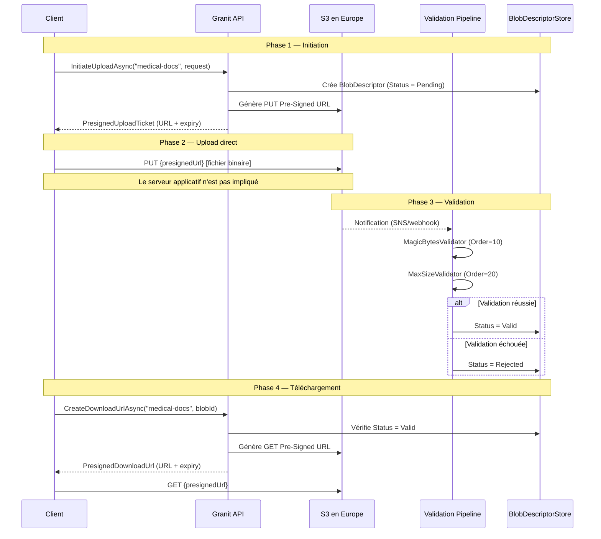

# Pre-Signed URL (Direct-to-Cloud)

## Définition

Le pattern Pre-Signed URL permet aux clients de charger ou télécharger des
fichiers directement vers/depuis le stockage objet (S3), sans transiter par
le serveur applicatif. Le serveur génère une URL temporaire signée
cryptographiquement, avec des contraintes (type MIME, taille max, expiration).

Dans Granit, ce pattern est au cœur de `Granit.BlobStorage` avec une
architecture Direct-to-Cloud, un pipeline de validation post-upload, et un
mécanisme de crypto-shredding conforme RGPD.

## Schéma



## Implémentation dans Granit

### Composants principaux

| Composant | Fichier | Rôle |
|-----------|---------|------|
| `IBlobStorage` | `src/Granit.BlobStorage/IBlobStorage.cs` | API publique : `InitiateUploadAsync`, `CreateDownloadUrlAsync`, `DeleteAsync` |
| `DefaultBlobStorage` | `src/Granit.BlobStorage/Internal/DefaultBlobStorage.cs` | Façade orchestrant tous les composants |
| `BlobDescriptor` | `src/Granit.BlobStorage/BlobDescriptor.cs` | Entité : status, metadata, audit trail |
| `BlobStatus` | `src/Granit.BlobStorage/BlobStatus.cs` | Machine à états : Pending → Uploading → Valid/Rejected → Deleted |
| `PresignedUploadTicket` | `src/Granit.BlobStorage/PresignedUploadTicket.cs` | DTO : BlobId, URL, HttpMethod, Expiry, RequiredHeaders |
| `PresignedDownloadUrl` | `src/Granit.BlobStorage/PresignedDownloadUrl.cs` | DTO : URL + expiry |

### Clé S3 multi-tenant

| Composant | Fichier | Rôle |
|-----------|---------|------|
| `IBlobKeyStrategy` | `src/Granit.BlobStorage/IBlobKeyStrategy.cs` | Génération et parsing de clés objet |
| `PrefixBlobKeyStrategy` | `src/Granit.BlobStorage.S3/Internal/PrefixBlobKeyStrategy.cs` | Format : `{tenantId}/{container}/{yyyy}/{MM}/{blobId}` |

### Validation post-upload

| Validateur | Fichier | Ordre | Rôle |
|-----------|---------|-------|------|
| `MagicBytesValidator` | `src/Granit.BlobStorage/Validators/MagicBytesValidator.cs` | 10 | Vérifie le type MIME réel (magic bytes) |
| `MaxSizeValidator` | `src/Granit.BlobStorage/Validators/MaxSizeValidator.cs` | 20 | Vérifie la taille déclarée vs réelle |

### Crypto-shredding (RGPD Art. 17)

`DefaultBlobStorage.DeleteAsync()` :

1. Supprime **physiquement** l'objet S3 (`storageClient.DeleteObjectAsync`)
2. Marque le `BlobDescriptor` comme `Deleted` (soft delete)
3. Conserve la métadonnée en DB pour la **piste d'audit ISO 27001** (3 ans)

## Justification

| Problème | Solution |
|----------|----------|
| Fichiers médicaux volumineux (IRM, scanners) saturent le serveur | Upload direct client → S3, le serveur ne voit jamais le binaire |
| Validation du type MIME côté client n'est pas fiable | Validation serveur post-upload via magic bytes |
| RGPD droit à l'effacement + ISO 27001 piste d'audit (contradictoires) | Crypto-shredding : binaire détruit, métadonnée conservée en soft delete |
| Isolation multi-tenant dans le bucket S3 | Clé préfixée par `tenantId` + vérification `TryExtractTenantId()` |
| Sécurité : le client ne doit pas avoir les credentials S3 | Pre-signed URL avec expiration courte, contraintes de type MIME |

## Exemple d'usage

```csharp
// Upload d'un document médical
public sealed class UploadMedicalDocumentHandler
{
    public static async Task<PresignedUploadTicket> Handle(
        UploadDocumentCommand command,
        IBlobStorage blobStorage,
        CancellationToken cancellationToken)
    {
        PresignedUploadTicket ticket = await blobStorage.InitiateUploadAsync(
            containerName: "medical-documents",
            new BlobUploadRequest(
                FileName: command.FileName,
                ContentType: "application/pdf",
                MaxAllowedBytes: 50_000_000), // 50 MB
            ct);

        // Le client utilise ticket.UploadUrl pour uploader directement vers S3
        return ticket;
    }
}

// Suppression conforme RGPD (crypto-shredding)
await blobStorage.DeleteAsync(
    containerName: "medical-documents",
    blobId: documentId,
    deletionReason: "RGPD Art. 17 — demande du patient",
    cancellationToken);
// → Objet S3 physiquement supprimé
// → BlobDescriptor conservé en DB (IsDeleted=true, DeletedBy, DeletedAt, DeletionReason)
```

## Pour en savoir plus

- [Valet Key pattern — Microsoft Cloud Design Patterns](https://learn.microsoft.com/en-us/azure/architecture/patterns/valet-key)
