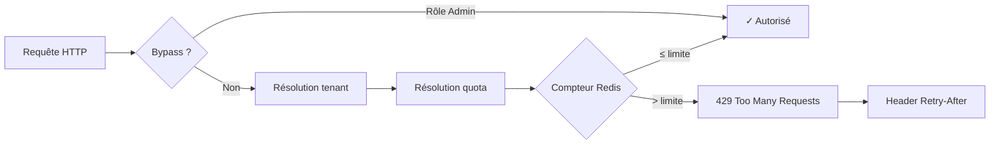
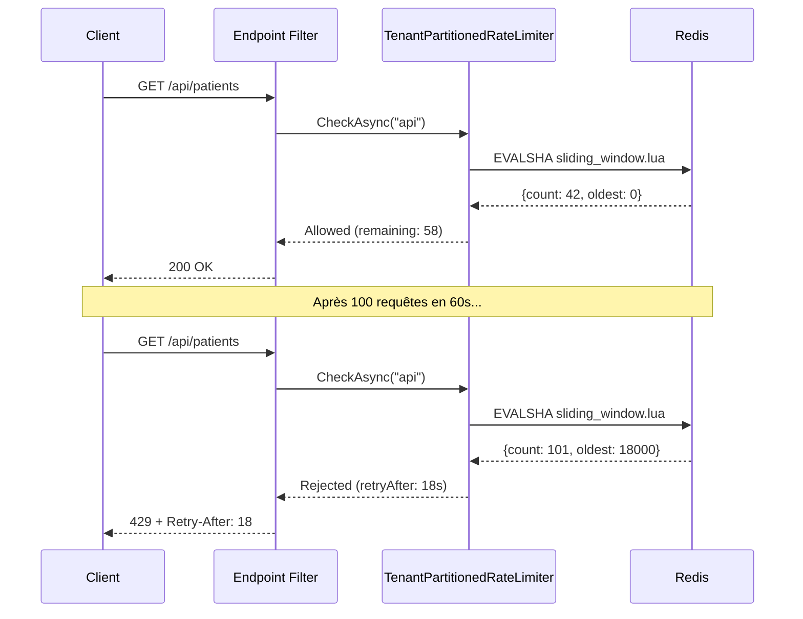

# Rate Limiting / Throttling

## Définition

Le **Rate Limiting** contrôle le nombre de requêtes qu'un client peut envoyer
dans une fenêtre de temps donnée. En contexte multi-tenant SaaS, il protège
contre le phénomène **noisy neighbor** — un tenant gourmand qui dégrade les
performances pour tous les autres. Granit implémente ce pattern via
`Granit.RateLimiting` avec partitionnement par tenant, compteurs Redis atomiques
(Lua scripts), et quotas dynamiques liés aux plans tarifaires via `Granit.Features`.

## Schéma





## Implémentation dans Granit

### Package

| Package | Rôle |
| --- | --- |
| `Granit.RateLimiting` | Module complet : compteurs, middleware, options, métriques |

### Trois algorithmes via Lua scripts

Chaque algorithme est implémenté comme un script Lua exécuté atomiquement par Redis
(`EVALSHA`). Les timestamps sont pris côté serveur (`redis.call('TIME')`) pour
éviter les problèmes de désynchronisation d'horloge entre les pods.

| Algorithme | Structure Redis | Cas d'usage |
| --- | --- | --- |
| **Sliding Window** | Sorted set (`ZADD` + `ZREMRANGEBYSCORE`) | API publiques — précision maximale |
| **Fixed Window** | Compteur (`INCR` + `PEXPIRE`) | Endpoints à faible volume — simplicité |
| **Token Bucket** | Hash (`HMGET`/`HSET` + refill) | Jobs d'export — rafales contrôlées |

### Partitionnement par tenant

La clé Redis est structurée avec un **hash tag** pour garantir la colocalisation
en Redis Cluster :

```text
{prefix}:{tenantId}:{policyName}
  rl   :{a1b2c3d4}:  api
```

Sans multi-tenancy, le segment `global` est utilisé. Chaque tenant a ses propres
compteurs — un tenant ne peut jamais consommer le quota d'un autre.

### Quotas dynamiques par plan

Quand `UseFeatureBasedQuotas` est activé, le `PermitLimit` est résolu
dynamiquement depuis `Granit.Features` au lieu de la configuration statique :

```csharp
// Convention : feature Numeric nommée "RateLimit.{policyName}"
context.Add(
    new FeatureDefinition("RateLimit.api", FeatureValueType.Numeric(100, 10, 10000))
);
```

La chaîne de résolution Features (Default → Plan → Tenant) permet des quotas
différenciés :

| Plan | RateLimit.api | RateLimit.export |
| --- | --- | --- |
| Free | 60/min | 5/h |
| Pro | 500/min | 50/h |
| Enterprise | 5000/min | Illimité |

### Double intégration : HTTP + Messaging

```csharp
// --- ASP.NET Core : endpoint filter ---
app.MapGet("/api/v1/patients", GetPatientsAsync)
   .RequireGranitRateLimiting("api");

// --- Wolverine : attribut sur le message ---
[RateLimited("export")]
public sealed record GeneratePatientExportCommand(Guid PatientId);
```

Le filtre HTTP retourne `429 Too Many Requests` (RFC 7807) avec header
`Retry-After`. Le middleware Wolverine lève `RateLimitExceededException`,
exploitable par `RetryWithCooldown`.

### Dégradation gracieuse

Quand Redis est indisponible, le comportement est configurable :

| Mode | Comportement | Quand l'utiliser |
| --- | --- | --- |
| `Allow` (défaut) | Requête autorisée + warning | Disponibilité > protection quota |
| `Deny` | 429 systématique | Endpoints critiques (paiement, auth) |

### Fichiers de référence

| Fichier | Rôle |
| --- | --- |
| `src/Granit.RateLimiting/Internal/LuaScripts.cs` | 3 scripts Lua atomiques |
| `src/Granit.RateLimiting/Internal/TenantPartitionedRateLimiter.cs` | Logique centrale (tenant, bypass, quota, métriques) |
| `src/Granit.RateLimiting/Internal/RedisRateLimitCounterStore.cs` | Exécution Redis avec fallback |
| `src/Granit.RateLimiting/Internal/FeatureBasedRateLimitQuotaProvider.cs` | Résolution quotas via Granit.Features |
| `src/Granit.RateLimiting/AspNetCore/RateLimitEndpointExtensions.cs` | Endpoint filter 429 + Retry-After |
| `src/Granit.RateLimiting/Wolverine/RateLimitMiddleware.cs` | Middleware Wolverine BeforeAsync |
| `docs/framework/api/rate-limiting.md` | Documentation framework complète |

## Justification

| Problème | Solution |
| --- | --- |
| Tenant gourmand sature l'API pour tous (noisy neighbor) | Compteurs partitionnés par tenant, quotas indépendants |
| Limites de quota identiques pour tous les plans | `Granit.Features` Numeric résout dynamiquement par plan |
| Panne Redis → service bloqué | Dégradation gracieuse configurable (Allow/Deny) |
| Drift d'horloge entre pods → compteurs incohérents | `redis.call('TIME')` dans les Lua scripts |
| Rate limiting HTTP mais pas messaging | Double intégration endpoint filter + Wolverine middleware |
| Admin bloqué par son propre rate limiting | `BypassRoles` configurable |

## Exemple d'usage

```csharp
// --- appsettings.json ---
// {
//   "RateLimiting": {
//     "BypassRoles": ["Admin"],
//     "UseFeatureBasedQuotas": true,
//     "Policies": {
//       "api": { "Algorithm": "SlidingWindow", "PermitLimit": 100, "Window": "00:01:00" },
//       "auth": { "Algorithm": "FixedWindow", "PermitLimit": 5, "Window": "00:15:00" }
//     }
//   }
// }

// --- Enregistrement du module ---
[DependsOn(typeof(GranitRateLimitingModule))]
public sealed class AppModule : GranitModule { }

// --- Application des policies ---
app.MapGet("/api/v1/appointments", ListAppointmentsAsync)
   .RequireGranitRateLimiting("api");

app.MapPost("/api/v1/auth/login", LoginAsync)
   .RequireGranitRateLimiting("auth");  // 5 tentatives / 15 min
```

## Pour en savoir plus

- [Rate Limiting pattern — Microsoft Cloud Design Patterns](https://learn.microsoft.com/en-us/azure/architecture/patterns/rate-limiting-pattern)
- [Throttling pattern — Microsoft Cloud Design Patterns](https://learn.microsoft.com/en-us/azure/architecture/patterns/throttling)
- [Documentation Granit.RateLimiting](../../framework/api/rate-limiting.md)
