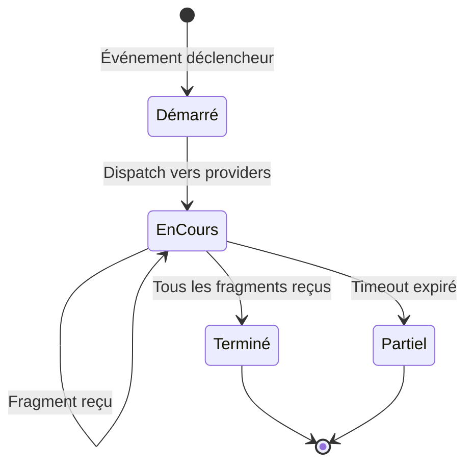
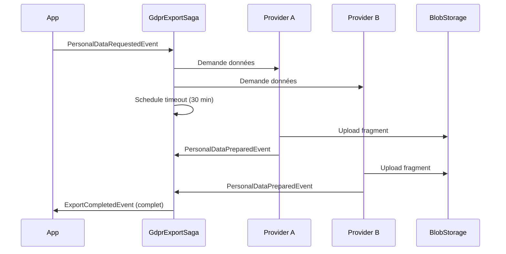

# Saga / Process Manager

## Définition

Le **Saga** (ou Process Manager) orchestre un processus métier composé de
plusieurs étapes distribuées, chacune pouvant échouer indépendamment. Contrairement
à une transaction ACID classique, le saga maintient un état intermédiaire persistant
et gère les compensations ou les timeouts. Granit implémente ce pattern via
Wolverine Sagas (corrélation + persistance) et des orchestrateurs custom pour
les pipelines d'import/export.

## Schéma





## Implémentation dans Granit

Granit utilise le pattern Saga / Process Manager dans 4 contextes distincts :

### 1. GdprExportSaga — Scatter-Gather (Wolverine Saga)

Orchestration RGPD Article 15/20 (droit d'accès/portabilité). Collecte des
fragments de données personnelles depuis plusieurs providers, avec timeout
configurable.

| Élément | Détail |
| --- | --- |
| Classe | `GdprExportSaga` (hérite `Saga`) |
| Package | `Granit.Privacy` |
| État persisté | `ExpectedCount`, `ReceivedFragments`, `PendingProviders` |
| Corrélation | `RequestId` (Guid) |
| Timeout | Wolverine scheduled message (`ExportTimedOutEvent`) |

```csharp
// Démarrage du saga — dispatch vers tous les providers enregistrés
public async Task<ExportCompletedEvent?> StartAsync(
    PersonalDataRequestedEvent @event,
    IDataProviderRegistry registry,
    IOptions<GranitPrivacyOptions> options,
    IMessageContext context)
{
    Id = @event.RequestId;
    UserId = @event.UserId;
    ExpectedCount = registry.Count;

    // Schedule timeout — si tous les providers n'ont pas répondu
    await context.ScheduleAsync(
        new ExportTimedOutEvent(Id),
        TimeSpan.FromMinutes(options.Value.ExportTimeoutMinutes))
        .ConfigureAwait(false);

    return ExpectedCount == 0
        ? new ExportCompletedEvent(Id, [], IsPartial: false)
        : null;
}
```

**Conformité ISO 27001** : seuls les `BlobReferenceId` sont stockés dans l'état
du saga — aucune donnée personnelle brute ne transite ni ne persiste.

### 2. EfImportOrchestrator — Pipeline de traitement

Orchestration du pipeline d'import : Load → Parse → Map → Validate → Resolve
Identity → Execute. Utilise `IAsyncEnumerable` pour le streaming et persiste
l'état via `ImportJob` en base de données.

| Élément | Détail |
| --- | --- |
| Classe | `EfImportOrchestrator` |
| Package | `Granit.DataExchange.EntityFrameworkCore` |
| État persisté | `ImportJob` (Status, ReportJson) |
| Modes | Execute (commit) / DryRun (rollback) |

### 3. ExportOrchestrator — Export asynchrone

Orchestration de l'export : résolution de la définition → streaming des données →
projection des champs → écriture du fichier → stockage blob. Le job est dispatché
en background via Wolverine.

| Élément | Détail |
| --- | --- |
| Classe | `ExportOrchestrator` |
| Package | `Granit.DataExchange` |
| État persisté | `ExportJob` (Status, BlobReference, RowCount) |
| Dispatch | Wolverine background message |

### 4. WorkflowManager — Machine à états avec approbation

Orchestration de workflows métier avec transitions, permissions et routage
vers un état `PendingReview` quand l'approbation est requise.

| Élément | Détail |
| --- | --- |
| Classe | `WorkflowManager<TState>` |
| Package | `Granit.Workflow` |
| État | Enum `TState` (finite state machine) |
| Résultats | `Completed`, `ApprovalRequested`, `Denied`, `InvalidTransition` |

### Fichiers de référence

| Fichier | Rôle |
| --- | --- |
| `src/Granit.Privacy/DataExport/GdprExportSaga.cs` | Saga RGPD scatter-gather |
| `src/Granit.Privacy/DataExport/GdprExportSagaState.cs` | État du saga |
| `src/Granit.DataExchange.EntityFrameworkCore/Internal/Import/Pipeline/EfImportOrchestrator.cs` | Pipeline d'import |
| `src/Granit.DataExchange/Export/Internal/ExportOrchestrator.cs` | Pipeline d'export |
| `src/Granit.Workflow/WorkflowManager.cs` | FSM avec approbation |

## Justification

| Problème | Solution |
| --- | --- |
| Export RGPD multi-providers → certains providers lents ou down | Timeout configurable + résultat partiel |
| Import CSV de 100k lignes → mémoire | `IAsyncEnumerable` streaming, pas de chargement complet |
| Export volumineux bloque la requête HTTP | Dispatch background + polling par job ID |
| Workflow avec approbation → logique dispersée | FSM centralisée avec routage automatique vers PendingReview |
| Données personnelles dans l'état du saga | Seuls les `BlobReferenceId` sont persistés (ISO 27001) |

## Exemple d'usage

```csharp
// --- Déclencher un export RGPD ---
await messageBus.PublishAsync(
    new PersonalDataRequestedEvent(
        RequestId: Guid.NewGuid(),
        UserId: patient.Id),
    cancellationToken).ConfigureAwait(false);

// Le GdprExportSaga collecte les fragments de chaque provider.
// Quand tous les fragments sont reçus (ou timeout) :
// → ExportCompletedEvent { BlobReferences, IsPartial }

// --- Déclencher un import ---
Guid jobId = await importOrchestrator
    .ExecuteAsync(importJobId, cancellationToken)
    .ConfigureAwait(false);
// ImportJob.Status passe de Executing → Completed/Failed

// --- Transition workflow ---
TransitionResult<InvoiceStatus> result = await workflowManager
    .TransitionAsync(
        InvoiceStatus.Draft,
        InvoiceStatus.Approved,
        new TransitionContext("Validation comptable"),
        cancellationToken)
    .ConfigureAwait(false);
// result.Outcome = Completed | ApprovalRequested | Denied
```

## Pour en savoir plus

- [Saga pattern — Microsoft Cloud Design Patterns](https://learn.microsoft.com/en-us/azure/architecture/reference-architectures/saga/saga)
- [Process Manager — Enterprise Integration Patterns](https://www.enterpriseintegrationpatterns.com/patterns/messaging/ProcessManager.html)
- [Wolverine Sagas](https://wolverine.netlify.app/guide/durability/sagas.html)
