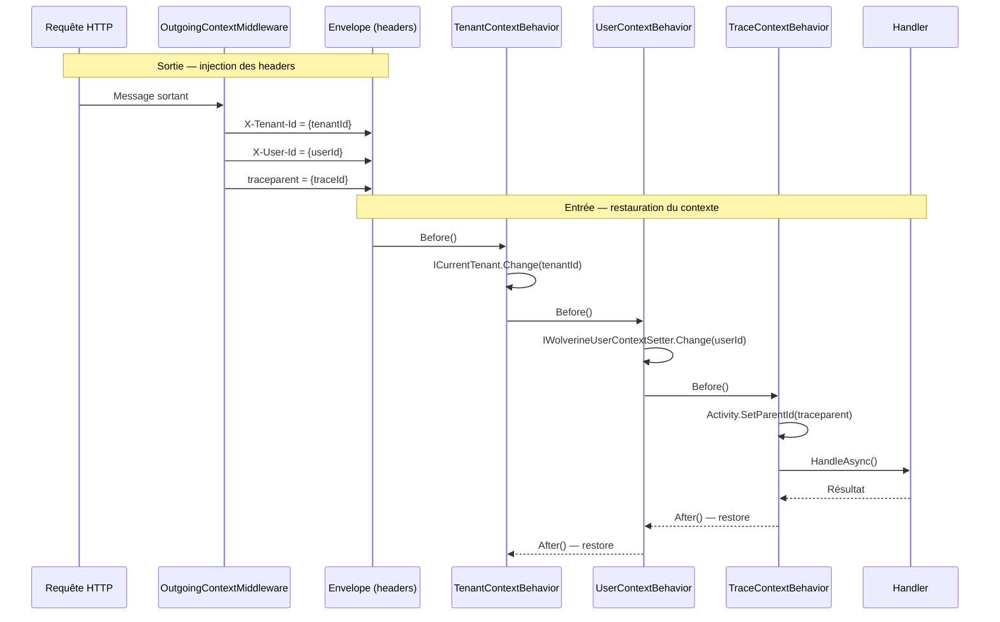

# Sidecar / Wolverine Behavior

## Définition

Le pattern Sidecar attache des responsabilités transverses à un composant
principal sans modifier son code. Dans le contexte de Wolverine, les
**Behaviors** (Before/After) s'exécutent autour de chaque handler de message,
restaurant le contexte (tenant, user, trace) perdu lors du passage de la
frontière HTTP → Outbox → background thread.

Granit implémente trois behaviors entrants et un middleware sortant, formant
un pont de contexte entre les requêtes HTTP et les traitements asynchrones.

## Schéma



## Implémentation dans Granit

### Middleware sortant

| Composant | Fichier | Rôle |
|-----------|---------|------|
| `OutgoingContextMiddleware` | `src/Granit.Wolverine/Middleware/OutgoingContextMiddleware.cs` | Injecte `X-Tenant-Id`, `X-User-Id`, `traceparent` dans les enveloppes Wolverine sortantes |

Conditions d'injection :

- `X-Tenant-Id` : uniquement si `currentTenant.Id.HasValue`
- `X-User-Id` : uniquement si `currentUserService.IsAuthenticated` et
  `UserId is { Length: > 0 }`
- `traceparent` : si une `Activity` est en cours

### Behaviors entrants

| Behavior | Fichier | Lifecycle | Rôle |
|----------|---------|-----------|------|
| `TenantContextBehavior` | `src/Granit.Wolverine/Behaviors/TenantContextBehavior.cs` | Before/After | Lit `X-Tenant-Id` → `ICurrentTenant.Change(tenantId)` |
| `UserContextBehavior` | `src/Granit.Wolverine/Behaviors/UserContextBehavior.cs` | Before/After | Lit `X-User-Id` → `IWolverineUserContextSetter.Change(userId)` |
| `TraceContextBehavior` | `src/Granit.Wolverine/Behaviors/TraceContextBehavior.cs` | Before/After | Lit `traceparent` → lie l'`Activity` du handler au trace parent |

Chaque `Before()` retourne un `IDisposable` scope. Le `After()` dispose le
scope, restaurant le contexte précédent (important pour les handlers chaînés).

### Enregistrement

Dans `src/Granit.Wolverine/Extensions/WolverineHostApplicationBuilderExtensions.cs` :

```csharp
opts.Policies.AddMiddleware<OutgoingContextMiddleware>();
// Les behaviors sont enregistrés via Wolverine's handler chain discovery
```

### Interface interne

| Interface | Fichier | Rôle |
|-----------|---------|------|
| `IWolverineUserContextSetter` | `src/Granit.Wolverine/Internal/IWolverineUserContextSetter.cs` | Permet de remplacer le user context sans HttpContext |
| `WolverineCurrentUserService` | `src/Granit.Wolverine/Internal/WolverineCurrentUserService.cs` | Implémentation `AsyncLocal` : override > HttpContext fallback |

## Justification

| Problème | Solution |
|----------|----------|
| Les background handlers n'ont pas de `HttpContext` | Les behaviors restaurent le contexte depuis les headers d'envelope |
| L'intercepteur d'audit EF Core a besoin de `ModifiedBy` en background | `UserContextBehavior` restaure `ICurrentUserService` via `AsyncLocal` |
| Les traces OpenTelemetry sont disjointes entre HTTP et async | `TraceContextBehavior` lie les spans via W3C `traceparent` |
| Les query filters EF Core multi-tenant ne fonctionnent pas en background | `TenantContextBehavior` restaure `ICurrentTenant` → les filtres s'appliquent |
| Le handler doit rester pur (pas de code d'infrastructure) | Toute la mécanique de contexte est dans les behaviors, invisible pour le handler |

## Exemple d'usage

```csharp
// Le handler est complètement pur — aucune conscience des behaviors
public static class ProcessMedicalReportHandler
{
    public static async Task Handle(
        ProcessMedicalReportCommand command,
        ICurrentTenant currentTenant,       // ← restauré par TenantContextBehavior
        ICurrentUserService currentUser,    // ← restauré par UserContextBehavior
        AppDbContext db,
        CancellationToken ct)
    {
        // currentTenant.Id est le même que celui de la requête HTTP d'origine
        // currentUser.UserId est le même que celui qui a initié l'opération

        MedicalReport report = await db.Reports.FindAsync([command.ReportId], ct)
            ?? throw new EntityNotFoundException(typeof(MedicalReport), command.ReportId);

        report.MarkAsProcessed();
        await db.SaveChangesAsync(ct);

        // L'AuditedEntityInterceptor enregistre :
        // ModifiedBy = currentUser.UserId (pas "system")
        // L'Activity OpenTelemetry est liée au trace parent HTTP
    }
}
```
