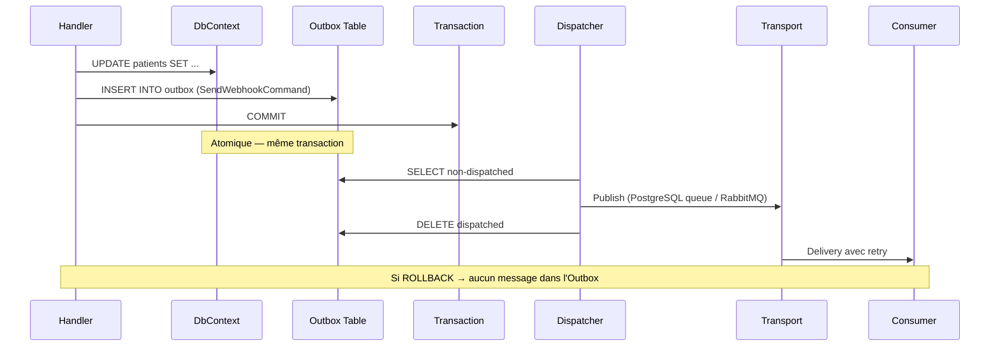

# Outbox transactionnel (Transactional Outbox)

## Définition

Le pattern Transactional Outbox garantit la publication fiable d'événements
en les persistant dans la même transaction que les données métier. Si la
transaction est validée (commit), les événements sont garantis livrés. Si elle
échoue (rollback), les événements sont supprimés avec les données — aucune
incohérence possible.

Granit délègue l'Outbox à Wolverine, qui stocke les messages dans une table
dédiée de la base de données applicative. Un dispatcher arrière-plan relaye
les messages vers les transports configurés après le commit.

## Schéma



## Implémentation dans Granit

### Configuration Wolverine

L'Outbox est activé par les modules provider (PostgreSQL, SQL Server) et non
par `Granit.Wolverine` lui-même (qui reste transport-agnostique).

| Composant | Fichier | Rôle |
|-----------|---------|------|
| `AddGranitWolverine()` | `src/Granit.Wolverine/Extensions/WolverineHostApplicationBuilderExtensions.cs` | Configure le bus, les retries, les behaviors — **pas l'Outbox** |
| `GranitWolverinePostgresqlModule` | `src/Granit.Wolverine.Postgresql/GranitWolverinePostgresqlModule.cs` | Active l'Outbox PostgreSQL |

### Routage des événements

```csharp
// IDomainEvent → local queue (JAMAIS l'Outbox)
opts.PublishMessage<IDomainEvent>().ToLocalQueue("domain-events");

// IIntegrationEvent → transport configuré (avec Outbox)
// Le routage est configuré par le module provider
```

### Fan-out pattern (Wolverine natif)

Les handlers retournant `IEnumerable<T>` produisent plusieurs messages Outbox
dans la même transaction :

| Handler | Fichier | Messages produits |
|---------|---------|-------------------|
| `WebhookFanoutHandler` | `src/Granit.Webhooks/Handlers/WebhookFanoutHandler.cs` | N × `SendWebhookCommand` (un par souscription active) |

### Rescheduling atomique (BackgroundJobs)

| Composant | Fichier | Rôle |
|-----------|---------|------|
| `RecurringJobSchedulingMiddleware` | `src/Granit.BackgroundJobs/Internal/RecurringJobSchedulingMiddleware.cs` | Insère le prochain scheduled message dans l'Outbox **avant** l'exécution du handler |

Le middleware `Before()` écrit le prochain message schedulé + met à jour
`NextExecutionAt` en DB. Tout est dans la même transaction Outbox. Si le
handler échoue, le rollback annule aussi le rescheduling — pas de doublons
ni de messages perdus.

## Justification

| Problème | Solution |
|----------|----------|
| « Fire and forget » après le commit perd des messages si le processus crash | L'Outbox persiste le message AVANT le commit, dans la même transaction |
| Double écriture (DB + message broker) crée des incohérences | Transaction unique élimine le problème |
| Les domain events ne doivent pas traverser les frontières de service | `IDomainEvent` est explicitement routé en local, jamais l'Outbox |
| Les background jobs doivent se re-planifier atomiquement | `RecurringJobSchedulingMiddleware` utilise l'Outbox pour l'atomicité |
| Fan-out de webhooks : N notifications pour 1 événement | `IEnumerable<SendWebhookCommand>` produit N messages Outbox atomiquement |

## Exemple d'usage

```csharp
// Le handler retourne des messages — Wolverine les persiste dans l'Outbox
public static class InvoiceCreatedHandler
{
    public static IEnumerable<object> Handle(
        CreateInvoiceCommand command,
        InvoiceDbContext db)
    {
        Invoice invoice = new()
        {
            PatientId = command.PatientId,
            Amount = command.Amount
        };

        db.Invoices.Add(invoice);
        // SaveChangesAsync est appelé par Wolverine (auto-transaction)

        // Ces messages sont persistés dans l'Outbox, pas envoyés immédiatement
        yield return new SendInvoiceEmailCommand { InvoiceId = invoice.Id };
        yield return new NotifyAccountingEvent { InvoiceId = invoice.Id, Amount = invoice.Amount };

        // Si la transaction échoue → aucun message n'est envoyé
        // Si la transaction réussit → les deux messages sont garantis livrés
    }
}
```
