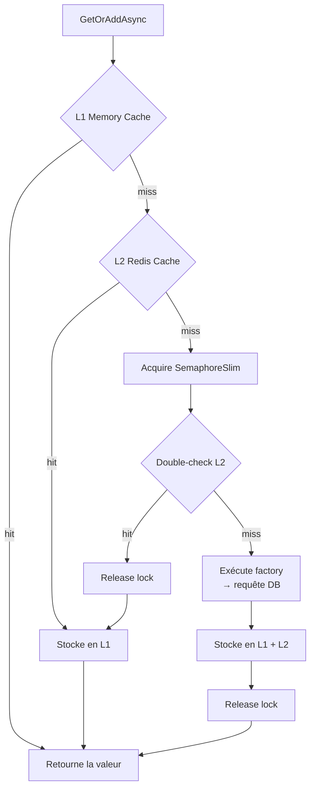

# Cache-Aside (Lazy Loading)

## Définition

Le pattern Cache-Aside charge les données en cache à la demande : lors d'un
miss, les données sont récupérées de la source (DB), stockées en cache, puis
retournées. Les accès suivants sont servis depuis le cache.

Granit utilise un **HybridCache** (L1 in-process + L2 Redis) avec protection
anti-stampede via double-check locking.

## Schéma



## Implémentation dans Granit

| Composant | Fichier | Rôle |
|-----------|---------|------|
| `DistributedCacheService` | `src/Granit.Caching/DistributedCacheService.cs` | Cache-aside avec double-check locking et chiffrement optionnel |
| `FeatureChecker` | `src/Granit.Features/Checker/FeatureChecker.cs` | HybridCache pour la résolution de features |
| `CachedLocalizationOverrideStore` | `src/Granit.Localization/CachedLocalizationOverrideStore.cs` | Cache mémoire pour les overrides de localisation |

### Anti-stampede

Le `SemaphoreSlim` dans `DistributedCacheService` empêche le « thundering
herd » : quand 100 requêtes simultanées ont un cache miss, une seule exécute
la factory. Les 99 autres attendent le lock puis trouvent la valeur en cache
(double-check).

### Clés par tenant

Dans `FeatureChecker`, les clés de cache incluent le tenant :
`t:{tenantId}:{featureName}`. L'invalidation cible uniquement le tenant
concerné.

## Justification

| Problème | Solution |
|----------|----------|
| Résolution de features trop lente (DB à chaque requête) | Cache L1 (nanosecondes) + L2 Redis (microsecondes) |
| Stampede sur cache miss (100 requêtes → 100 queries DB) | SemaphoreSlim + double-check locking |
| Données sensibles en cache Redis | Chiffrement AES-256 conditionnel via `[CacheEncrypted]` |

## Exemple d'usage

```csharp
// Le cache-aside est transparent pour l'appelant
ICacheService<PatientDto> cache = serviceProvider
    .GetRequiredService<ICacheService<PatientDto>>();

PatientDto patient = await cache.GetOrAddAsync(
    $"patient:{patientId}",
    async ct => await LoadPatientFromDbAsync(patientId, ct),
    cancellationToken);
// 1er appel → DB + stocke en cache
// 2e appel → retourné depuis le cache (L1 ou L2)
```
