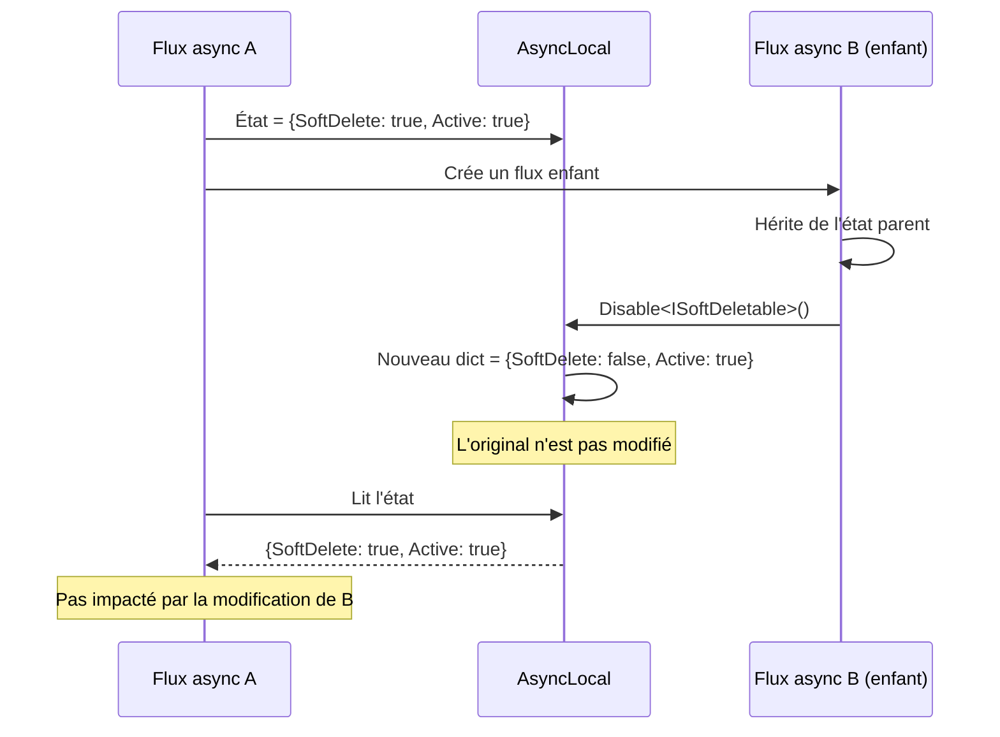

# Copy-on-Write (État immuable)

## Définition

Le pattern Copy-on-Write garantit la thread-safety en créant une nouvelle
copie de la structure de données à chaque modification, au lieu de muter
l'existante. L'état précédent reste intact, permettant une restauration
simple et éliminant les data races.

## Schéma



## Implémentation dans Granit

| Composant | Fichier | Structure |
|-----------|---------|-----------|
| `DataFilter` | `src/Granit.Core/DataFiltering/DataFilter.cs` | `AsyncLocal<ImmutableDictionary<Type, bool>>` |

Le `DataFilter` utilise `ImmutableDictionary<Type, bool>.SetItem()` qui
retourne un **nouveau** dictionnaire sans muter l'original. Combiné avec
`AsyncLocal<T>`, cela garantit :

1. **Isolation par flux** : un flux enfant qui modifie les filtres ne
   perturbe pas le flux parent
2. **Restauration** : le scope `IDisposable` conserve une référence vers
   l'ancien dictionnaire et le restaure au `Dispose()`
3. **Pas de verrou** : `ImmutableDictionary` est intrinsèquement thread-safe

### Piège évité — mutation du flux enfant

Sans copy-on-write, un `AsyncLocal<Dictionary<T>>` partagé entre parent et
enfant pourrait voir les mutations de l'enfant affecter le parent. Avec
`ImmutableDictionary`, `SetItem()` crée une nouvelle référence qui ne
remonte pas vers le parent.

## Justification

Le filtrage de données doit être isolé par scope de requête. Si un middleware
désactive temporairement le soft delete pour une opération admin, cette
désactivation ne doit pas fuiter vers d'autres requêtes concurrentes ou vers
des flux `Task.Run()` enfants.

## Exemple d'usage

```csharp
// Le copy-on-write est transparent — l'API reste simple
using (dataFilter.Disable<ISoftDeletable>())
{
    // Nouveau ImmutableDictionary créé : {SoftDelete: false}
    // L'original reste intact

    await Task.Run(async () =>
    {
        // Ce flux enfant hérite de {SoftDelete: false}
        // Mais si l'enfant appelle Enable<ISoftDeletable>(),
        // cela crée un NOUVEAU dict pour l'enfant sans toucher le parent
    });
}
// Le Dispose() restaure l'ancien ImmutableDictionary original
```
