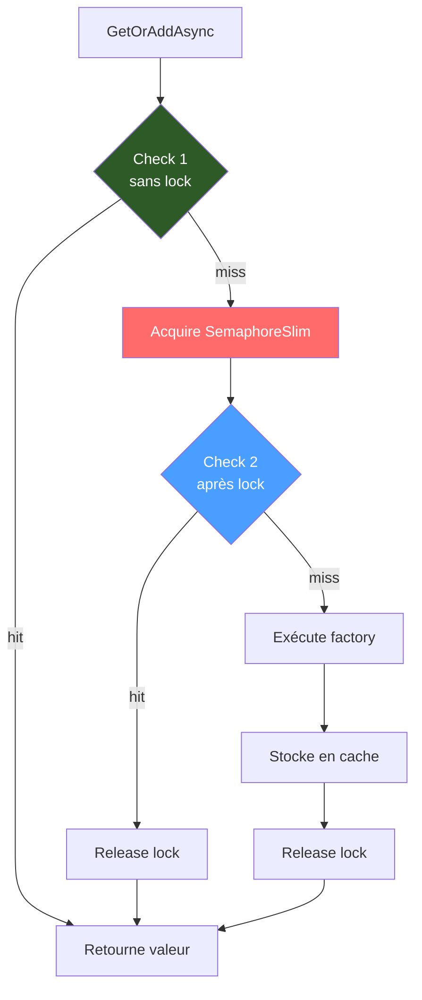

# Double-Check Locking

## Définition

Le pattern Double-Check Locking optimise l'accès concurrent à une ressource
partagée en vérifiant la condition **avant** et **après** l'acquisition d'un
verrou. Le premier check (sans lock) sert de fast-path pour le cas nominal
(cache hit). Le second check (après lock) protège contre les races.

## Schéma



## Implémentation dans Granit

| Composant | Fichier | Lignes |
|-----------|---------|--------|
| `DistributedCacheService.GetOrAddAsync()` | `src/Granit.Caching/DistributedCacheService.cs` | 74-92 |

### Déroulement

1. **Check 1** (ligne 74) : lecture du cache sans verrou — fast-path
2. **Acquire** (ligne 78) : `SemaphoreSlim.WaitAsync(cancellationToken)`
3. **Check 2** (ligne 82) : re-lecture du cache après lock
4. **Factory** (ligne 86) : exécution de la factory si toujours miss
5. **Set** (ligne 89) : stockage en cache
6. **Release** (ligne 92) : `SemaphoreSlim.Release()` dans un `finally`

### Anti-stampede

Si 100 requêtes simultanées ont un cache miss :

- Les 100 passent le Check 1 (miss)
- 1 acquiert le lock, les 99 attendent
- La 1ère exécute la factory et remplit le cache
- Les 99 passent le Check 2 → cache hit, pas de factory

Résultat : **1 seule requête DB** au lieu de 100.

## Justification

Le double-check locking est essentiel pour la résolution de features dans
un environnement à forte concurrence. Sans protection, un cache miss
simultané (cache expiration, restart) pourrait surcharger la base de données.

## Exemple d'usage

```csharp
// Le double-check locking est interne — l'API est simple
ICacheService<PatientDto> cache = provider.GetRequiredService<ICacheService<PatientDto>>();

// 100 appels simultanés avec le même cache key :
// → 1 requête DB (la première)
// → 99 réponses depuis le cache (après le lock)
PatientDto patient = await cache.GetOrAddAsync(
    $"patient:{patientId}",
    async ct => await db.Patients.FindAsync([patientId], ct),
    cancellationToken);
```
