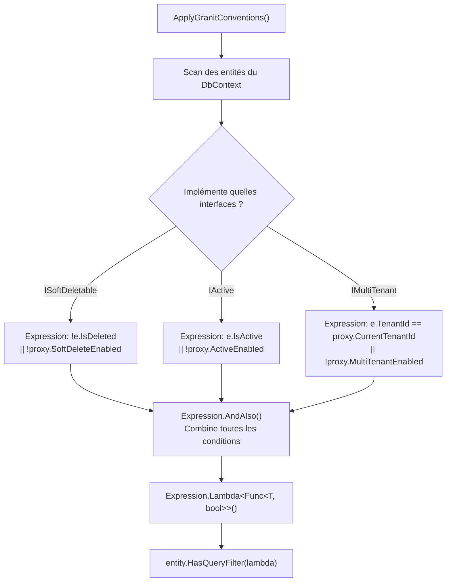

# Expression Trees (Arbres d'expressions)

## Définition

Les Expression Trees permettent de construire des requêtes ou des filtres
à l'exécution sous forme d'arbre syntaxique, au lieu de les écrire
statiquement dans le code source. EF Core traduit ces arbres en SQL.

Dans Granit, `ApplyGranitConventions()` construit dynamiquement les query
filters EF Core pour chaque entité en combinant les filtres `ISoftDeletable`,
`IActive` et `IMultiTenant` en une seule expression.

## Schéma



## Implémentation dans Granit

| Composant | Fichier | Lignes |
|-----------|---------|--------|
| `ApplyGranitConventions()` | `src/Granit.Persistence/Extensions/ModelBuilderExtensions.cs` | 54-126 |
| `FilterProxy` | `src/Granit.Persistence/Extensions/ModelBuilderExtensions.cs` | 133-140 |

### Pourquoi un FilterProxy ?

EF Core ne peut pas traduire des appels de méthode arbitraires (comme
`dataFilter.IsEnabled<ISoftDeletable>()`) dans un query filter. Le
`FilterProxy` expose des **propriétés simples** que EF Core extrait comme
des paramètres SQL :

```csharp
// FilterProxy expose des propriétés que EF Core comprend
internal sealed class FilterProxy(IDataFilter? dataFilter, ICurrentTenant? tenant)
{
    public bool SoftDeleteEnabled => dataFilter?.IsEnabled<ISoftDeletable>() ?? true;
    public bool ActiveEnabled => dataFilter?.IsEnabled<IActive>() ?? true;
    public bool MultiTenantEnabled => dataFilter?.IsEnabled<IMultiTenant>() ?? true;
    public Guid? CurrentTenantId => tenant?.Id;
}
```

### Pourquoi un seul HasQueryFilter ?

EF Core (versions < 10) écrase les query filters précédents si
`HasQueryFilter()` est appelé plusieurs fois sur la même entité.
L'expression combinée via `AndAlso` résout ce problème en un seul appel.

## Justification

La construction dynamique permet de gérer automatiquement les combinaisons
d'interfaces (une entité peut implémenter 0, 1, 2 ou 3 interfaces marqueur)
sans écrire de code spécifique pour chaque combinaison (2^3 = 8 cas).

## Exemple d'usage

```csharp
// L'application appelle une seule ligne dans OnModelCreating
protected override void OnModelCreating(ModelBuilder modelBuilder)
{
    modelBuilder.ApplyGranitConventions(serviceProvider);
    // → Construit dynamiquement les query filters pour toutes les entités
}

// Le filtre est automatique et transparent
List<Patient> patients = await db.Patients.ToListAsync(ct);
// SQL généré :
// SELECT * FROM Patients
// WHERE (@SoftDeleteEnabled = 0 OR IsDeleted = 0)
//   AND (@MultiTenantEnabled = 0 OR TenantId = @CurrentTenantId)
```
