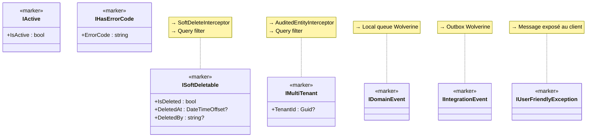

# Marker Interface (Interface marqueur)

## Définition

Une Marker Interface est une interface sans méthode (ou avec des propriétés
minimales) qui signale qu'un type possède un comportement ou une
caractéristique spécifique. Les composants du framework détectent ces
interfaces par réflexion et appliquent le comportement associé.

## Schéma



## Implémentation dans Granit

### Marqueurs d'entités

| Interface | Fichier | Détectée par |
|-----------|---------|-------------|
| `ISoftDeletable` | `src/Granit.Core/Domain/ISoftDeletable.cs` | `SoftDeleteInterceptor`, `ApplyGranitConventions()` |
| `IMultiTenant` | `src/Granit.Core/Domain/IMultiTenant.cs` | `AuditedEntityInterceptor`, `ApplyGranitConventions()` |
| `IActive` | `src/Granit.Core/Domain/IActive.cs` | `ApplyGranitConventions()` |

### Marqueurs d'événements

| Interface | Fichier | Détectée par |
|-----------|---------|-------------|
| `IDomainEvent` | `src/Granit.Core/Events/IDomainEvent.cs` | Wolverine routing → local queue |
| `IIntegrationEvent` | `src/Granit.Core/Events/IIntegrationEvent.cs` | Wolverine routing → transport/Outbox |

### Marqueurs d'exceptions

| Interface | Fichier | Détectée par |
|-----------|---------|-------------|
| `IUserFriendlyException` | `src/Granit.Core/Exceptions/IUserFriendlyException.cs` | `GranitExceptionHandler` — message exposé au client |
| `IHasErrorCode` | `src/Granit.Core/Exceptions/IHasErrorCode.cs` | `GranitExceptionHandler` — error code dans ProblemDetails |
| `IHasValidationErrors` | `src/Granit.Core/Exceptions/IHasValidationErrors.cs` | `GranitExceptionHandler` — field errors dans extensions |

### Marqueurs d'idempotence

| Interface | Fichier | Détectée par |
|-----------|---------|-------------|
| `IIdempotencyMetadata` | `src/Granit.Idempotency/Abstractions/IIdempotencyMetadata.cs` | `IdempotencyMiddleware` — active l'idempotence sur l'endpoint |

## Justification

Les marqueurs permettent d'appliquer des comportements transversaux (audit,
filtrage, routage) de manière déclarative, sans coupler les entités au
framework d'infrastructure. Une entité implémentant `ISoftDeletable` obtient
automatiquement le soft delete et le query filter — aucun code supplémentaire.

## Exemple d'usage

```csharp
// L'entité déclare ses caractéristiques via des marqueurs
public sealed class MedicalRecord : FullAuditedEntity, IMultiTenant, IActive
{
    public Guid? TenantId { get; set; }       // ← IMultiTenant
    public bool IsActive { get; set; } = true; // ← IActive
    // ISoftDeletable est hérité de FullAuditedEntity

    public string Diagnosis { get; set; } = string.Empty;
}

// Le framework détecte les marqueurs et applique automatiquement :
// - Query filter : WHERE IsDeleted=false AND IsActive=true AND TenantId=@tid
// - Interceptor audit : CreatedAt/By, ModifiedAt/By, TenantId
// - Interceptor soft delete : DELETE → UPDATE IsDeleted=true
```
