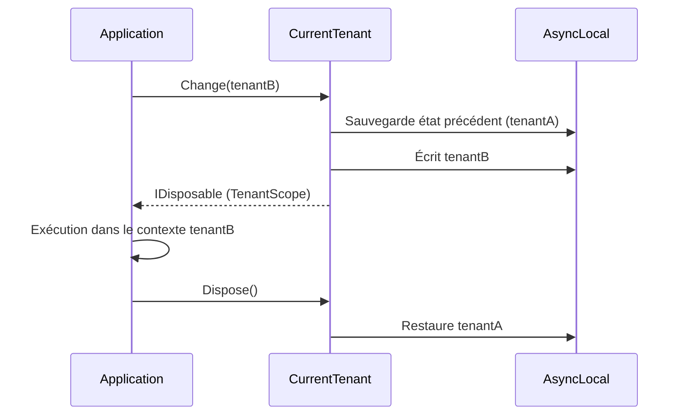

# Scope / Context Manager

## Définition

Le pattern Scope Manager encapsule un changement de contexte dans un objet
`IDisposable`. Le contexte est modifié à la création du scope et
automatiquement restauré au `Dispose()`, garantissant un retour à l'état
précédent même en cas d'exception.

## Schéma



## Implémentation dans Granit

| Scope | Fichier | Contexte géré |
|-------|---------|---------------|
| `TenantScope` | `src/Granit.MultiTenancy/CurrentTenant.cs` | `ICurrentTenant.Change(tenantId)` → restaure le tenant précédent |
| `FilterScope` | `src/Granit.Core/DataFiltering/DataFilter.cs` | `IDataFilter.Disable<T>()` → réactive le filtre |
| Wolverine behaviors | `src/Granit.Wolverine/Behaviors/UserContextBehavior.cs` | `IWolverineUserContextSetter.Change()` → restaure le user |

Tous les scopes utilisent `AsyncLocal<T>` pour la propagation thread-safe
à travers les frontières `async/await`.

## Justification

Le pattern `using` du C# garantit le `Dispose()` même en cas d'exception,
éliminant le risque de fuite de contexte (un tenant qui reste actif après
une erreur).

## Exemple d'usage

```csharp
// Changement temporaire de tenant — restauration automatique
using (currentTenant.Change(adminTenantId))
{
    // Toutes les requêtes dans ce scope visent adminTenantId
    List<AuditLog> logs = await db.AuditLogs.ToListAsync(ct);
} // Le tenant précédent est automatiquement restauré

// Désactivation temporaire du filtre soft delete
using (dataFilter.Disable<ISoftDeletable>())
{
    // Les enregistrements supprimés sont visibles
    List<Patient> allPatients = await db.Patients.ToListAsync(ct);
} // Le filtre est automatiquement réactivé
```
