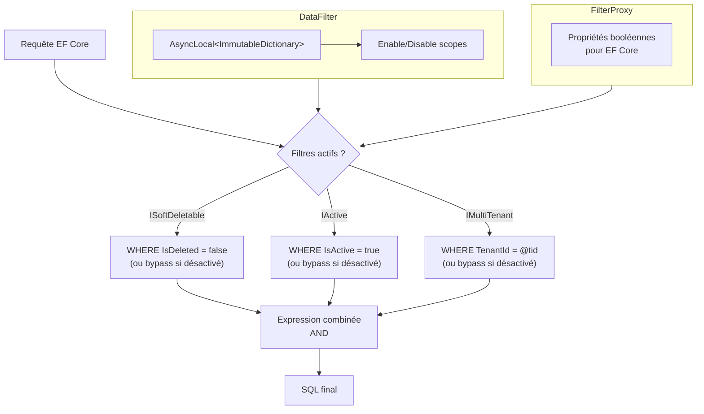

# Data Filtering (Filtrage de données)

## Définition

Le pattern Data Filtering applique automatiquement des filtres globaux aux
requêtes EF Core en fonction des interfaces marqueur implémentées par les
entités. Les filtres sont activés par défaut et peuvent être désactivés
temporairement via un scope `IDisposable`.

Granit supporte trois filtres :

- `ISoftDeletable` → `WHERE IsDeleted = false`
- `IActive` → `WHERE IsActive = true`
- `IMultiTenant` → `WHERE TenantId = @currentTenantId`

## Schéma



## Implémentation dans Granit

| Composant | Fichier | Rôle |
|-----------|---------|------|
| `IDataFilter` | `src/Granit.Core/DataFiltering/IDataFilter.cs` | Interface : `IsEnabled<T>()`, `Disable<T>()`, `Enable<T>()` |
| `DataFilter` | `src/Granit.Core/DataFiltering/DataFilter.cs` | Implémentation `AsyncLocal<ImmutableDictionary<Type, bool>>` |
| `FilterProxy` | `src/Granit.Persistence/Extensions/ModelBuilderExtensions.cs` | Proxy exposant des propriétés pour EF Core |
| `ApplyGranitConventions()` | `src/Granit.Persistence/Extensions/ModelBuilderExtensions.cs` | Construit les Expression Trees pour `HasQueryFilter()` |

### Construction dynamique des filtres

`ApplyGranitConventions()` utilise des **Expression Trees** pour construire
un filtre unique par entité combinant tous les filtres applicables :

```csharp
// Pseudo-code du filtre généré pour une entité FullAuditedEntity + IMultiTenant
entity => (!proxy.SoftDeleteEnabled || !entity.IsDeleted)
       && (!proxy.MultiTenantEnabled || entity.TenantId == proxy.CurrentTenantId)
```

Le `FilterProxy` est essentiel : EF Core ne peut pas appeler des méthodes
dans un query filter. Le proxy expose des propriétés simples que EF Core
traduit en paramètres SQL.

### État thread-safe via AsyncLocal + ImmutableDictionary

Le `DataFilter` utilise `AsyncLocal<ImmutableDictionary<Type, bool>>` :

- **AsyncLocal** : l'état est isolé par flux `async/await`
- **ImmutableDictionary** : `SetItem()` crée un nouveau dictionnaire (copy-on-write)
- **IDisposable scope** : `Disable<T>()` retourne un scope qui restaure
  l'état précédent au `Dispose()`

## Justification

| Problème | Solution |
|----------|----------|
| Oublier un `WHERE IsDeleted = false` dans une requête | Le filtre est automatique, appliqué à toutes les requêtes |
| Isolation multi-tenant : une requête qui fuite les données d'un autre tenant | `WHERE TenantId = @tid` automatique sur toute entité `IMultiTenant` |
| Besoin admin de voir les données supprimées | `dataFilter.Disable<ISoftDeletable>()` dans un scope limité |
| Thread safety dans les scénarios async | `AsyncLocal` + `ImmutableDictionary` (copy-on-write) |

## Exemple d'usage

```csharp
// Les filtres sont automatiques — rien à faire
List<Patient> activePatients = await db.Patients.ToListAsync(ct);
// SQL: SELECT ... WHERE IsDeleted = 0 AND TenantId = @tid

// Désactiver temporairement le filtre soft delete
using (dataFilter.Disable<ISoftDeletable>())
{
    List<Patient> allPatients = await db.Patients.ToListAsync(ct);
    // SQL: SELECT ... WHERE TenantId = @tid (pas de filtre IsDeleted)
}
// Le filtre est automatiquement réactivé ici
```

## Pour en savoir plus

- [Query Object — Martin Fowler (PoEAA)](https://martinfowler.com/eaaCatalog/queryObject.html)
