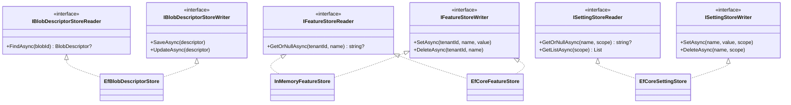

# Repository (Store)

## Définition

Le pattern Repository abstrait l'accès aux données derrière une interface de
type collection, isolant la logique métier des détails de persistence. Dans
Granit, les repositories sont nommés **Stores** et offrent des
implémentations interchangeables (InMemory, EF Core, Redis).

## Schéma



## Implémentation dans Granit

| Store (port) | Fichier | Implémentations |
| ----------- | ------- | --------------- |
| `IBlobDescriptorStoreReader` / `IBlobDescriptorStoreWriter` | `src/Granit.BlobStorage/` | `EfBlobDescriptorStore` |
| `IFeatureStoreReader` / `IFeatureStoreWriter` | `src/Granit.Features/Store/` | `InMemoryFeatureStore`, `EfCoreFeatureStore` |
| `IBackgroundJobStoreReader` / `IBackgroundJobStoreWriter` | `src/Granit.BackgroundJobs/Internal/` | `InMemoryBackgroundJobStore`, `EfBackgroundJobStore` |
| `ISettingStoreReader` / `ISettingStoreWriter` | `src/Granit.Settings/Values/` | `EfCoreSettingStore` |
| `IWebhookSubscriptionStoreReader` / `IWebhookSubscriptionStoreWriter` | `src/Granit.Webhooks/Abstractions/` | `EfWebhookSubscriptionStore` |

Chaque store EF Core utilise un `DbContext` isolé (pas le DbContext
applicatif) via `IDbContextFactory<T>`.

## Justification

Le découplage permet d'utiliser `InMemoryFeatureStore` en développement et
`EfCoreFeatureStore` en production sans changer le code applicatif. La séparation
Reader/Writer (CQRS) permet d'injecter uniquement l'interface nécessaire : les
handlers de lecture n'ont accès qu'au Reader, les handlers d'écriture au Writer.
Les tests unitaires utilisent les stores InMemory pour éviter les bases de données.

## Exemple d'usage

```csharp
// Lecture — injecter le Reader
IFeatureStoreReader reader = serviceProvider.GetRequiredService<IFeatureStoreReader>();
string? value = await reader.GetOrNullAsync(tenantId, "MaxPatients", ct);

// Écriture — injecter le Writer
IFeatureStoreWriter writer = serviceProvider.GetRequiredService<IFeatureStoreWriter>();
await writer.SetAsync(tenantId, "MaxPatients", "500", ct);
```

## Pour en savoir plus

- [Repository — Martin Fowler (PoEAA)](https://martinfowler.com/eaaCatalog/repository.html)
