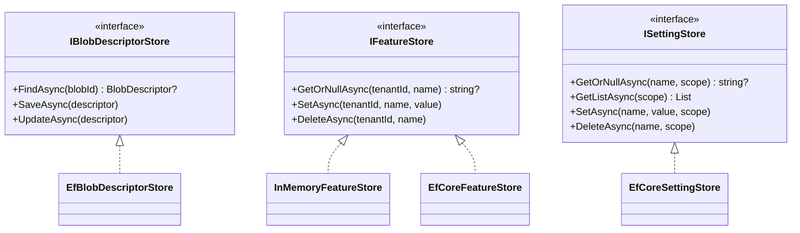

# Repository (Store)

## Définition

Le pattern Repository abstrait l'accès aux données derrière une interface de
type collection, isolant la logique métier des détails de persistence. Dans
Granit, les repositories sont nommés **Stores** et offrent des
implémentations interchangeables (InMemory, EF Core, Redis).

## Schéma



## Implémentation dans Granit

| Store (port) | Fichier | Implémentations |
|-------------|---------|-----------------|
| `IBlobDescriptorStore` | `src/Granit.BlobStorage/IBlobDescriptorStore.cs` | `EfBlobDescriptorStore` |
| `IFeatureStore` | `src/Granit.Features/Store/IFeatureStore.cs` | `InMemoryFeatureStore`, `EfCoreFeatureStore` |
| `IBackgroundJobStore` | `src/Granit.BackgroundJobs/Internal/IBackgroundJobStore.cs` | `InMemoryBackgroundJobStore`, `EfBackgroundJobStore` |
| `ISettingStore` | `src/Granit.Settings/Values/ISettingStore.cs` | `EfCoreSettingStore` |
| `IWebhookSubscriptionStore` | `src/Granit.Webhooks/Abstractions/IWebhookSubscriptionStore.cs` | `EfWebhookSubscriptionStore` |

Chaque store EF Core utilise un `DbContext` isolé (pas le DbContext
applicatif) via `IDbContextFactory<T>`.

## Justification

Le découplage permet d'utiliser `InMemoryFeatureStore` en développement et
`EfCoreFeatureStore` en production sans changer le code applicatif. Les tests
unitaires utilisent les stores InMemory pour éviter les bases de données.

## Exemple d'usage

```csharp
// Le code applicatif ne connaît que l'interface
IFeatureStore store = serviceProvider.GetRequiredService<IFeatureStore>();

string? value = await store.GetOrNullAsync(tenantId, "MaxPatients", ct);
await store.SetAsync(tenantId, "MaxPatients", "500", ct);
```
