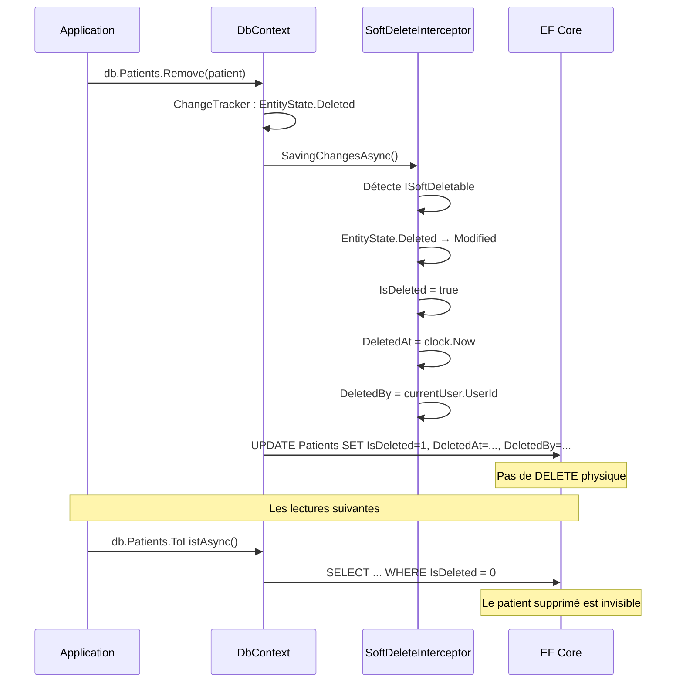

# Soft Delete (Suppression logique)

## Définition

Le pattern Soft Delete remplace la suppression physique par une mise à jour
d'un flag `IsDeleted`. L'enregistrement reste en base mais est masqué par
les query filters. Ce pattern est **obligatoire** dans Granit pour la
conformité HDS (piste d'audit 3 ans) et RGPD (traçabilité de l'effacement).

## Schéma



## Implémentation dans Granit

| Composant | Fichier | Rôle |
|-----------|---------|------|
| `ISoftDeletable` | `src/Granit.Core/Domain/ISoftDeletable.cs` | Interface marqueur : `IsDeleted`, `DeletedAt`, `DeletedBy` |
| `FullAuditedEntity` | `src/Granit.Core/Domain/FullAuditedEntity.cs` | Implémente `ISoftDeletable` |
| `SoftDeleteInterceptor` | `src/Granit.Persistence/Interceptors/SoftDeleteInterceptor.cs` | Convertit `Deleted` → `Modified`, remplit les champs d'audit |
| `ApplyGranitConventions()` | `src/Granit.Persistence/Extensions/ModelBuilderExtensions.cs` | Applique le query filter `WHERE IsDeleted = false` |
| `IDataFilter` | `src/Granit.Core/DataFiltering/IDataFilter.cs` | Permet de désactiver temporairement le filtre |

### Crypto-shredding (BlobStorage)

Le `BlobStorage` est un cas particulier : la suppression est **hybride** :

1. **Suppression physique** de l'objet S3 (crypto-shredding RGPD Art. 17)
2. **Soft delete** du `BlobDescriptor` en DB (piste d'audit HDS)

```
src/Granit.BlobStorage/Internal/DefaultBlobStorage.cs:
  → storageClient.DeleteObjectAsync()  // physique S3
  → descriptor.MarkAsDeleted()         // soft delete DB
```

## Justification

| Exigence réglementaire | Réponse du pattern |
|------------------------|-------------------|
| HDS — piste d'audit 3 ans | `DeletedAt` + `DeletedBy` conservés en DB |
| RGPD Art. 17 — droit à l'effacement | Crypto-shredding : données binaires détruites, métadonnées conservées |
| RGPD Art. 15 — droit d'accès | L'historique complet est consultable (qui, quand, quoi) |
| Audit interne — traçabilité | `ICurrentUserService.UserId` capture l'acteur de la suppression |

## Exemple d'usage

```csharp
// Suppression standard — interceptée automatiquement
db.Patients.Remove(patient);
await db.SaveChangesAsync(ct);
// → UPDATE: IsDeleted=true, DeletedAt=now, DeletedBy=currentUser

// Lecture admin — désactive temporairement le filtre
using (dataFilter.Disable<ISoftDeletable>())
{
    // Inclut les patients supprimés (audit, conformité)
    List<Patient> allPatients = await db.Patients.ToListAsync(ct);
}
```
