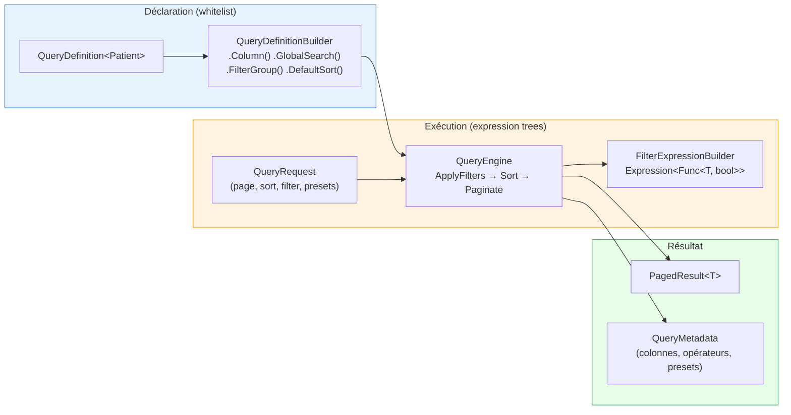

# Specification (Declarative Query DSL)

## Définition

Le pattern Specification encapsule une règle métier dans un objet réutilisable
et composable. Granit l'implémente sous forme d'un **DSL déclaratif de requêtes**
(whitelist-first) qui construit des `Expression<Func<TEntity, bool>>` à partir
de critères filtrés, triés et paginés — le tout traduit en SQL par EF Core.

## Schéma



## Implémentation dans Granit

### Trois packages

| Package | Rôle |
| --- | --- |
| `Granit.Querying` | Interfaces, builder fluent, DTOs (`QueryRequest`, `PagedResult<T>`) |
| `Granit.Querying.EntityFrameworkCore` | Moteur d'exécution : expression trees, tri dynamique, pagination |
| `Granit.Querying.Endpoints` | Binding REST (`filter[field.op]=value`), endpoints metadata + saved views |

### QueryDefinition — la spécification déclarative

Chaque entité déclare ses capacités de requête via une classe
`QueryDefinition<TEntity>`. **Rien n'est exposé par défaut** — toute colonne
filtrable, triable ou groupable doit être explicitement whitelistée.

```csharp
public sealed class PatientQueryDefinition : QueryDefinition<Patient>
{
    public override string Name => "Acme.Patients";

    protected override void Configure(QueryDefinitionBuilder<Patient> builder) =>
        builder
            .Column(p => p.Niss, c => c.Label("NISS").Filterable().Sortable())
            .Column(p => p.Email, c => c.Label("Email").Filterable())
            .GlobalSearch(p => p.Niss, p => p.Email, p => p.LastName)
            .FilterGroup("Status", g => g
                .Preset("Active", p => p.Status == PatientStatus.Active, isDefault: true)
                .Preset("Inactive", p => p.Status == PatientStatus.Inactive))
            .DefaultSort("-LastName")
            .DefaultPageSize(25);
}
```

### Opérateurs inférés par type

| Type C# | Opérateurs disponibles |
| --- | --- |
| `string` | Eq, Contains, StartsWith, EndsWith, In |
| `int`, `decimal`, `double` | Eq, Gt, Gte, Lt, Lte, In, Between |
| `DateTime`, `DateTimeOffset` | Eq, Gt, Gte, Lt, Lte, Between |
| `bool` | Eq |
| `enum` | Eq, In |
| `Guid` | Eq, In |

### Pipeline d'exécution

Le `QueryEngine` applique les filtres dans cet ordre :

1. **Filtres** (`filter[field.op]=value`) — validés contre la whitelist,
   compilés en `Expression<Func<T, bool>>` via `FilterExpressionBuilder`
2. **Presets** (`presets[group]=name1,name2`) — OR dans un groupe, AND entre groupes
3. **Quick filters** (`quickFilters=MyItems,Unread`) — AND indépendants
4. **Global search** (`search=Alice`) — OR sur les propriétés déclarées
5. **Tri dynamique** (`sort=-createdAt,lastName`) — `OrderBy`/`ThenBy` via expressions
6. **Pagination** — offset (`page`, `pageSize`) ou keyset (`cursor`)

### Sécurité whitelist-first

Les champs non déclarés dans la `QueryDefinition` sont **silencieusement ignorés**.
Aucune injection SQL n'est possible : toutes les valeurs passent par des
`Expression` typées, jamais par concaténation de chaînes.

### Fichiers de référence

| Fichier | Rôle |
| --- | --- |
| `src/Granit.Querying/QueryDefinition.cs` | Classe abstraite de spécification |
| `src/Granit.Querying/QueryDefinitionBuilder.cs` | Builder fluent (Column, FilterGroup, GlobalSearch) |
| `src/Granit.Querying/Filtering/FilterCriteria.cs` | Record (Field, Operator, Value) |
| `src/Granit.Querying/Filtering/FilterOperator.cs` | Enum des opérateurs |
| `src/Granit.Querying/QueryRequest.cs` | DTO de requête (page, sort, filter, presets) |
| `src/Granit.Querying.EntityFrameworkCore/Internal/FilterExpressionBuilder.cs` | Compilation filter → Expression |
| `src/Granit.Querying.EntityFrameworkCore/Internal/QueryableFilterExtensions.cs` | Application des filtres sur IQueryable |
| `src/Granit.Querying.EntityFrameworkCore/Internal/QueryableSortExtensions.cs` | Tri dynamique via expressions |
| `src/Granit.Querying.EntityFrameworkCore/Internal/QueryablePaginationExtensions.cs` | Pagination offset + keyset |
| `src/Granit.Querying.Endpoints/Binding/QueryRequestBinder.cs` | Parsing REST query string |

## Justification

| Problème | Solution Specification |
| --- | --- |
| Exposition de tous les champs en filtrage (injection, perf) | Whitelist-first : seuls les champs déclarés sont filtrables |
| Construction dynamique de SQL via concaténation | Expression trees typées, traduites par EF Core |
| Duplication de la logique de filtrage dans chaque endpoint | `QueryDefinition<T>` centralise la déclaration par entité |
| Le frontend ne sait pas quels filtres sont disponibles | Endpoint `/meta` retourne les colonnes, opérateurs et presets |
| Preset filters dupliqués entre frontend et backend | Présets déclarés côté serveur, exposés via metadata |

## Exemple d'usage

```csharp
// --- Déclaration (une fois par entité) ---
public sealed class InvoiceQueryDefinition : QueryDefinition<Invoice>
{
    public override string Name => "Billing.Invoices";

    protected override void Configure(QueryDefinitionBuilder<Invoice> builder) =>
        builder
            .Column(i => i.Number, c => c.Label("Invoice #").Filterable().Sortable())
            .Column(i => i.Amount, c => c.Label("Amount").Filterable().Sortable())
            .Column(i => i.IssuedAt, c => c.Label("Issued").Sortable())
            .DateFilter(i => i.IssuedAt, DatePeriod.Last30Days)
            .FilterGroup("Status", g => g
                .Preset("Draft", i => i.Status == InvoiceStatus.Draft)
                .Preset("Sent", i => i.Status == InvoiceStatus.Sent, isDefault: true)
                .Preset("Paid", i => i.Status == InvoiceStatus.Paid))
            .GlobalSearch(i => i.Number, i => i.CustomerName)
            .DefaultSort("-IssuedAt")
            .SupportsCursorPagination(i => i.IssuedAt);
}

// --- Utilisation (endpoint) ---
// GET /api/invoices?filter[amount.gte]=1000&presets[status]=Sent,Paid&sort=-issuedAt&page=1
group.MapQueryEndpoints<Invoice>("/api/invoices",
    sp => sp.GetRequiredService<BillingDbContext>().Invoices.AsNoTracking());
```

## Pour en savoir plus

- [Specification pattern — deviq.com (Ardalis)](https://deviq.com/design-patterns/specification-pattern)
- [Query Object — Martin Fowler (PoEAA)](https://martinfowler.com/eaaCatalog/queryObject.html)
