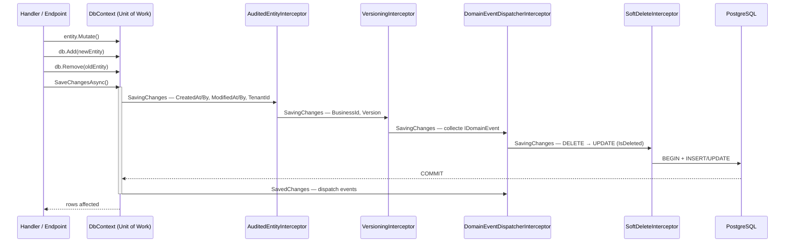

# Unit of Work (implicite via DbContext)

## Définition

Le Unit of Work maintient une liste d'objets modifiés au cours d'une transaction
métier et coordonne l'écriture atomique de ces changements. Dans Granit,
`DbContext` est le Unit of Work : le `ChangeTracker` accumule les mutations,
et `SaveChangesAsync()` les persiste en une seule transaction.

## Schéma



## Implémentation dans Granit

Granit n'expose pas d'interface `IUnitOfWork` explicite. Le `DbContext` EF Core
remplit ce rôle, enrichi par une **chaîne d'intercepteurs** qui s'exécutent
dans un ordre strictement défini à chaque `SaveChangesAsync()`.

### Chaîne d'intercepteurs

Enregistrée dans `src/Granit.Persistence/Extensions/DbContextOptionsBuilderExtensions.cs` :

| Ordre | Intercepteur | Rôle |
| --- | --- | --- |
| 1 | `AuditedEntityInterceptor` | ISO 27001 — `CreatedAt/By`, `ModifiedAt/By`, `TenantId`, auto-`Id` |
| 2 | `VersioningInterceptor` | `BusinessId` et `Version` sur les entités `IVersioned` |
| 3 | `DomainEventDispatcherInterceptor` | Collecte les `IDomainEvent` avant save, dispatch après commit |
| 4 | `SoftDeleteInterceptor` | RGPD — convertit `DELETE` → `UPDATE` (`IsDeleted`, `DeletedAt/By`) |

**L'ordre est critique** : `SoftDeleteInterceptor` est dernier car il change
`EntityState.Deleted → Modified`, ce qui masquerait l'état original aux
intercepteurs précédents.

### DbContextFactory (frontière du Unit of Work)

Chaque appel à `CreateDbContextAsync()` retourne une instance fraîche de
`DbContext` — un nouveau Unit of Work. Les intercepteurs sont injectés
automatiquement par la factory.

```csharp
// Pattern typique : un UoW par opération
await using TContext db = await dbContextFactory
    .CreateDbContextAsync(cancellationToken).ConfigureAwait(false);
db.DeliveryAttempts.Add(attempt);
await db.SaveChangesAsync(cancellationToken).ConfigureAwait(false);
```

### Intégration Wolverine Outbox

`AutoApplyTransactions()` enveloppe chaque handler Wolverine dans une
transaction DB. Les messages Outbox et les changements domaine sont
committés atomiquement dans le même `SaveChangesAsync()`.

### Roslyn Analyzer GR-EF001

`src/Granit.Analyzers/SynchronousSaveChangesAnalyzer.cs` émet un warning
quand `SaveChanges()` synchrone est appelé au lieu de `SaveChangesAsync()`.

### Fichiers de référence

| Fichier | Rôle |
| --- | --- |
| `src/Granit.Persistence/Interceptors/AuditedEntityInterceptor.cs` | Audit trail ISO 27001 |
| `src/Granit.Persistence/Interceptors/SoftDeleteInterceptor.cs` | Soft delete RGPD |
| `src/Granit.Persistence/Interceptors/VersioningInterceptor.cs` | Auto-versioning |
| `src/Granit.Persistence/Interceptors/DomainEventDispatcherInterceptor.cs` | Événements domaine atomiques |
| `src/Granit.Persistence/Extensions/DbContextOptionsBuilderExtensions.cs` | Câblage de la chaîne d'intercepteurs |
| `src/Granit.Persistence/Extensions/PersistenceServiceCollectionExtensions.cs` | Enregistrement DI (tous Scoped) |
| `src/Granit.Wolverine.Postgresql/Extensions/WolverinePostgresqlHostApplicationBuilderExtensions.cs` | Outbox transactionnel |
| `src/Granit.Analyzers/SynchronousSaveChangesAnalyzer.cs` | Analyzer GR-EF001 |

## Justification

| Problème | Solution Unit of Work |
| --- | --- |
| Écriture partielle en cas d'erreur | `SaveChangesAsync()` = transaction atomique |
| Audit trail dispersé dans chaque handler | Les intercepteurs appliquent l'audit de façon transversale |
| Hard-delete accidentel (RGPD) | `SoftDeleteInterceptor` intercepte avant le `DELETE` |
| Domain events dispatchés avant le commit | `DomainEventDispatcherInterceptor` collecte avant, dispatch après |
| `SaveChanges()` synchrone bloque le thread pool | Analyzer GR-EF001 détecte et avertit au compile-time |

## Exemple d'usage

```csharp
// Le handler ne connaît pas les intercepteurs — ils s'exécutent
// automatiquement à chaque SaveChangesAsync()

public static async Task Handle(
    ArchivePatientCommand command,
    PatientDbContext db,
    CancellationToken cancellationToken)
{
    Patient patient = await db.Patients.FindAsync([command.PatientId], cancellationToken)
        ?? throw new EntityNotFoundException(typeof(Patient), command.PatientId);

    patient.Archive();          // ModifiedAt/By remplis par AuditedEntityInterceptor
    db.Remove(patient);         // SoftDeleteInterceptor → IsDeleted = true
    // DomainEventDispatcherInterceptor collecte PatientArchivedEvent

    await db.SaveChangesAsync(cancellationToken).ConfigureAwait(false);
    // 1 transaction : UPDATE (audit) + UPDATE (soft delete) + Outbox message
    // Puis dispatch PatientArchivedEvent
}
```

## Pour en savoir plus

- [Unit of Work — Martin Fowler (PoEAA)](https://martinfowler.com/eaaCatalog/unitOfWork.html)
