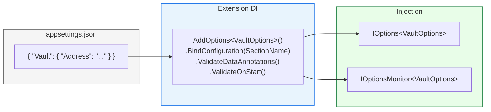

# Options Pattern (.NET)

## Définition

Le Options pattern structure la configuration applicative en classes fortement
typées, validées au démarrage. Chaque module Granit expose une classe `*Options`
liée à une section `appsettings.json` via `BindConfiguration`, avec validation
par `DataAnnotations` et `ValidateOnStart()`.

## Schéma



## Implémentation dans Granit

### Convention

Chaque classe Options suit ce template :

```csharp
public sealed class VaultOptions
{
    public const string SectionName = "Vault";

    [Required]
    public string Address { get; set; } = string.Empty;

    public string AuthMethod { get; set; } = "kubernetes";

    [Range(0.1, 1.0)]
    public double LeaseRenewalThreshold { get; set; } = 0.75;
}
```

Enregistrement dans l'extension DI du module :

```csharp
services.AddOptions<VaultOptions>()
    .BindConfiguration(VaultOptions.SectionName)
    .ValidateDataAnnotations()
    .ValidateOnStart();
```

### Inventaire (extrait — 93 classes Options dans le framework)

| Module | Classe | Section | Validation notable |
| --- | --- | --- | --- |
| Vault | `VaultOptions` | `Vault` | `[Required]` Address |
| Caching | `CachingOptions` | `Cache` | KeyPrefix, EncryptValues |
| Observability | `ObservabilityOptions` | `Observability` | ServiceName, OtlpEndpoint |
| Identity.Keycloak | `KeycloakAdminOptions` | `KeycloakAdmin` | `[Required]` + `[Range]` + URL helpers |
| Auth.JwtBearer | `JwtBearerAuthOptions` | `Authentication` | Authority, Audience |
| BlobStorage.S3 | `S3BlobOptions` | hérite `BlobStorageOptions` | `IValidateOptions<T>` custom |
| Webhooks | `WebhooksOptions` | `Webhooks` | `[Range(5, 120)]` timeout, `[Range(1, 100)]` parallelism |
| Notifications | `NotificationsOptions` | `Notifications` | MaxParallelDeliveries |
| Notifications.Brevo | `BrevoOptions` | `Notifications:Brevo` | `[Required]` ApiKey, `[Range(1, 300)]` timeout |
| MultiTenancy | `MultiTenancyOptions` | `MultiTenancy` | IsEnabled, TenantIdClaimType |

### Validation avancée (IValidateOptions)

Certains modules nécessitent une validation inter-propriétés. Ils implémentent
`IValidateOptions<T>` :

```csharp
internal sealed class S3BlobOptionsValidator : IValidateOptions<S3BlobOptions>
{
    public ValidateOptionsResult Validate(string? name, S3BlobOptions options)
    {
        if (string.IsNullOrWhiteSpace(options.ServiceUrl))
            return ValidateOptionsResult.Fail("S3 ServiceUrl is required.");

        if (options.ForcePathStyle && options.ServiceUrl.Contains("amazonaws.com"))
            return ValidateOptionsResult.Fail("ForcePathStyle should not be used with AWS.");

        return ValidateOptionsResult.Success;
    }
}
```

### Fichiers de référence

| Fichier | Rôle |
| --- | --- |
| `src/Granit.Vault/Options/VaultOptions.cs` | Exemple canonique simple |
| `src/Granit.Identity.Keycloak/Options/KeycloakAdminOptions.cs` | Options complexe avec helpers |
| `src/Granit.BlobStorage.S3/Options/S3BlobOptions.cs` | `IValidateOptions<T>` custom |
| `src/Granit.Webhooks/Options/WebhooksOptions.cs` | Validation `[Range]` |
| `src/Granit.Observability/Options/ObservabilityOptions.cs` | Options d'observabilité |

## Justification

| Problème | Solution Options pattern |
| --- | --- |
| Configuration lue comme strings non typées | Classes fortement typées avec IntelliSense |
| Erreur de config découverte au runtime | `ValidateOnStart()` — fail-fast au démarrage |
| Sections JSON mal nommées | `const string SectionName` = source unique |
| Validation inter-propriétés impossible avec annotations | `IValidateOptions<T>` pour les règles complexes |
| Secrets en clair dans appsettings | Compatible avec Vault, User Secrets, env vars |

## Exemple d'usage

```csharp
// --- Enregistrement dans l'extension DI du module ---
public static IServiceCollection AddGranitWebhooks(
    this IServiceCollection services)
{
    services.AddOptions<WebhooksOptions>()
        .BindConfiguration(WebhooksOptions.SectionName)
        .ValidateDataAnnotations()
        .ValidateOnStart();

    services.AddSingleton<IValidateOptions<WebhooksOptions>, WebhooksOptionsValidator>();

    return services;
}

// --- Consommation dans un service ---
public sealed class WebhookDeliveryService(
    IOptions<WebhooksOptions> options,
    IHttpClientFactory httpClientFactory)
{
    public async Task DeliverAsync(WebhookPayload payload, CancellationToken ct)
    {
        HttpClient client = httpClientFactory.CreateClient();
        client.Timeout = TimeSpan.FromSeconds(options.Value.HttpTimeoutSeconds);
        // ...
    }
}
```

## Pour en savoir plus

- [Options pattern — Microsoft .NET Documentation](https://learn.microsoft.com/en-us/dotnet/core/extensions/options)
