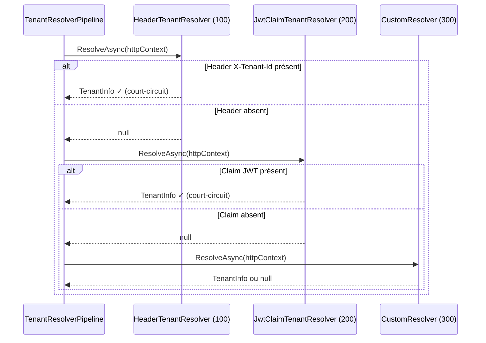

# Chain of Responsibility (Chaîne de responsabilité)

## Définition

Le pattern Chain of Responsibility fait passer une requête le long d'une
chaîne de handlers ordonnés. Chaque handler décide de traiter la requête ou
de la transmettre au suivant. Le premier handler capable de répondre
court-circuite la chaîne.

## Schéma



## Implémentation dans Granit

### Résolution de tenant

| Composant | Fichier | Rôle |
|-----------|---------|------|
| `TenantResolverPipeline` | `src/Granit.MultiTenancy/Pipeline/TenantResolverPipeline.cs` | Itère les `ITenantResolver` par `Order` croissant |
| `HeaderTenantResolver` | `src/Granit.MultiTenancy/Resolvers/HeaderTenantResolver.cs` | Order=100, lit `X-Tenant-Id` |
| `JwtClaimTenantResolver` | `src/Granit.MultiTenancy/Resolvers/JwtClaimTenantResolver.cs` | Order=200, lit le claim JWT |

### Validation de blobs

| Composant | Fichier | Order | Rôle |
|-----------|---------|-------|------|
| `MagicBytesValidator` | `src/Granit.BlobStorage/Validators/MagicBytesValidator.cs` | 10 | Vérifie le type MIME réel |
| `MaxSizeValidator` | `src/Granit.BlobStorage/Validators/MaxSizeValidator.cs` | 20 | Vérifie la taille |

La pipeline de validation des blobs est un cas particulier : **tous** les
validateurs sont exécutés (pas de court-circuit), mais l'ordre détermine la
priorité des messages d'erreur.

## Justification

La chaîne de résolution de tenant permet d'ajouter des resolvers (query
string, cookie, subdomain) sans modifier le code existant. L'ordre par
propriété `Order` est configurable sans recompilation.

## Exemple d'usage

```csharp
// Ajouter un resolver custom — s'insère dans la chaîne par Order
public sealed class SubdomainTenantResolver : ITenantResolver
{
    public int Order => 50; // Avant HeaderTenantResolver (100)

    public Task<TenantInfo?> ResolveAsync(HttpContext context, CancellationToken ct)
    {
        string host = context.Request.Host.Host;
        // Extraire le tenant du sous-domaine...
        return Task.FromResult<TenantInfo?>(tenantInfo);
    }
}

// Enregistrement
services.AddSingleton<ITenantResolver, SubdomainTenantResolver>();
```
