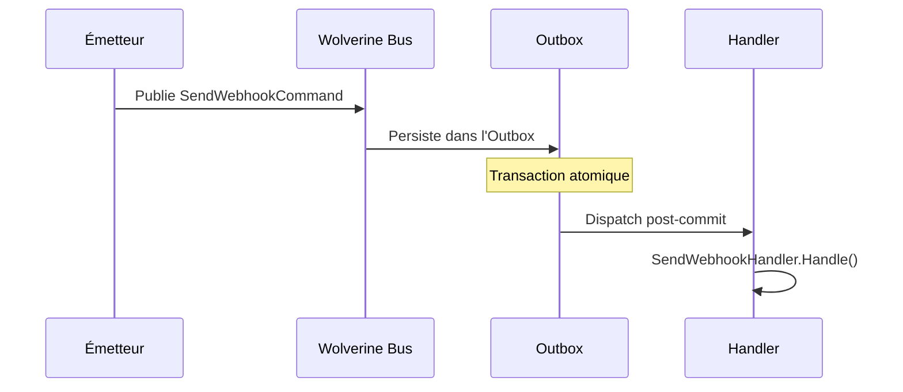

# Command

## Définition

Le pattern Command encapsule une requête en tant qu'objet, permettant de
paramétrer, mettre en file d'attente, journaliser et annuler des opérations.
La commande est un DTO sérialisable qui découple l'émetteur de l'exécuteur.

Dans Granit, les commandes sont des messages Wolverine traités par des
handlers découverts automatiquement.

## Schéma



## Implémentation dans Granit

| Commande | Fichier | Handler |
|----------|---------|---------|
| `SendWebhookCommand` | `src/Granit.Webhooks/Messages/SendWebhookCommand.cs` | `SendWebhookHandler` |
| `RunMigrationBatchCommand` | `src/Granit.Persistence.Migrations/Messages/RunMigrationBatchCommand.cs` | `RunMigrationBatchHandler` |

Les commandes sont des classes C# simples (DTOs sérialisables). Wolverine
découvre les handlers par convention de nommage (`Handle()` method).

## Justification

Les commandes permettent de découpler l'émetteur (handler HTTP) de l'exécuteur
(handler background). La sérialisation via l'Outbox garantit la livraison
même en cas de crash. Le retry automatique de Wolverine gère les échecs
transitoires.

## Exemple d'usage

```csharp
// Définir une commande
public sealed class SendInvoiceEmailCommand
{
    public required Guid InvoiceId { get; init; }
    public required string RecipientEmail { get; init; }
}

// Le handler est découvert automatiquement par Wolverine
public static class SendInvoiceEmailHandler
{
    public static async Task Handle(
        SendInvoiceEmailCommand command,
        IEmailService emailService,
        CancellationToken cancellationToken)
    {
        await emailService.SendInvoiceAsync(command.InvoiceId, command.RecipientEmail, ct);
    }
}

// Émission depuis un handler HTTP
public static class CreateInvoiceHandler
{
    public static IEnumerable<object> Handle(CreateInvoiceCommand cmd, InvoiceDbContext db)
    {
        Invoice invoice = new() { /* ... */ };
        db.Invoices.Add(invoice);

        // La commande est persistée dans l'Outbox, pas envoyée immédiatement
        yield return new SendInvoiceEmailCommand
        {
            InvoiceId = invoice.Id,
            RecipientEmail = cmd.Email
        };
    }
}
```

## Pour en savoir plus

- [Command — refactoring.guru](https://refactoring.guru/design-patterns/command)
