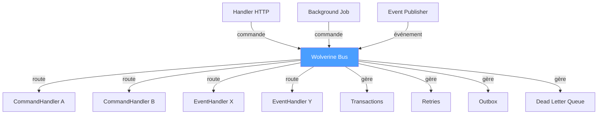

# Mediator

## Définition

Le pattern Mediator centralise les interactions entre composants via un objet
intermédiaire. Les composants ne communiquent pas directement entre eux ; ils
envoient des messages au médiateur qui les route vers les destinataires
appropriés.

Dans Granit, **Wolverine** est le médiateur central : il route les commandes,
événements et requêtes vers les handlers, gère les transactions, les retries,
et l'Outbox.

## Schéma



## Implémentation dans Granit

| Composant | Fichier | Rôle |
|-----------|---------|------|
| `GranitWolverineModule` | `src/Granit.Wolverine/GranitWolverineModule.cs` | Configuration du médiateur |
| `AddGranitWolverine()` | `src/Granit.Wolverine/Extensions/WolverineHostApplicationBuilderExtensions.cs` | Enregistrement des policies (retry, validation, DLQ) |
| `WolverineMessagingOptions` | `src/Granit.Wolverine/WolverineMessagingOptions.cs` | Retry delays : 5s, 30s, 5min |

### Policies gérées par le médiateur

- **FluentValidation** : messages invalides → DLQ immédiatement
- **Retry exponential** : `ValidationException` → DLQ, autres → 5s/30s/5min
- **Outbox** : messages `IIntegrationEvent` persistés atomiquement
- **Local queue** : messages `IDomainEvent` traités in-process

## Justification

Sans médiateur, chaque handler devrait connaître les autres handlers à
appeler, gérer ses propres transactions et retries. Wolverine centralise
cette logique et rend les handlers purs et testables.

## Exemple d'usage

```csharp
// Les handlers ne se connaissent pas — Wolverine route les messages
public static class CreatePatientHandler
{
    public static IEnumerable<object> Handle(
        CreatePatientCommand cmd,
        AppDbContext db)
    {
        Patient patient = new() { /* ... */ };
        db.Patients.Add(patient);

        // Wolverine route vers le bon handler automatiquement
        yield return new PatientCreatedOccurred { PatientId = patient.Id };
        yield return new SendWelcomeEmailCommand { Email = cmd.Email };
    }
}
// PatientCreatedOccurred → local queue → domain handler (même tx)
// SendWelcomeEmailCommand → Outbox → background handler (après commit)
```

## Pour en savoir plus

- [Mediator — refactoring.guru](https://refactoring.guru/design-patterns/mediator)
