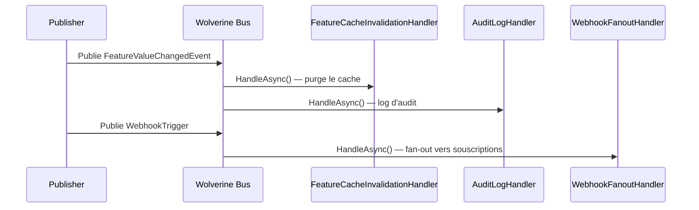

# Observer / Event

## Définition

Le pattern Observer établit une relation un-à-plusieurs entre objets : quand
un objet (sujet) change d'état, tous ses observateurs sont notifiés
automatiquement. Dans Granit, Wolverine agit comme le mécanisme de
souscription — les handlers sont découverts par convention et s'abonnent
implicitement aux types de messages qu'ils traitent.

## Schéma



## Implémentation dans Granit

### Souscription implicite Wolverine

Wolverine découvre automatiquement les handlers par convention de nommage.
Un handler qui accepte un paramètre de type `T` s'abonne implicitement à
tous les messages de type `T`.

| Handler (observer) | Événement (sujet) | Fichier |
|--------------------|-------------------|---------|
| `FeatureCacheInvalidationHandler` | `FeatureValueChangedEvent` | `src/Granit.Features/Cache/FeatureCacheInvalidationHandler.cs` |
| `WebhookFanoutHandler` | `WebhookTrigger` | `src/Granit.Webhooks/Handlers/WebhookFanoutHandler.cs` |

### Sidecar pattern (retour implicite)

Les handlers Wolverine peuvent retourner des événements via `yield return`
ou `IEnumerable<T>`. Wolverine dispatche automatiquement ces événements
vers les observers inscrits.

## Justification

L'observation implicite via Wolverine élimine le couplage entre le publisher
et les observers. Le publisher ne sait pas combien d'observers existent ni ce
qu'ils font. L'ajout d'un nouvel observer ne nécessite aucune modification du
publisher.

## Exemple d'usage

```csharp
// Publisher — ne connaît aucun observer
public static class UpdateFeatureValueHandler
{
    public static IEnumerable<object> Handle(
        UpdateFeatureValueCommand command,
        IFeatureStore store)
    {
        store.SetAsync(command.TenantId, command.FeatureName, command.Value);

        // Wolverine dispatche cet événement vers tous les handlers inscrits
        yield return new FeatureValueChangedEvent
        {
            TenantId = command.TenantId,
            FeatureName = command.FeatureName
        };
    }
}

// Observer 1 — découvert automatiquement
public static class FeatureCacheInvalidationHandler
{
    public static async Task Handle(
        FeatureValueChangedEvent evt,
        HybridCache cache)
    {
        string cacheKey = FeatureCacheKey.Build(evt.TenantId, evt.FeatureName);
        await cache.RemoveAsync(cacheKey);
    }
}

// Observer 2 — ajouté plus tard, aucune modification du publisher
public static class FeatureAuditLogHandler
{
    public static void Handle(FeatureValueChangedEvent evt, ILogger logger)
    {
        logger.LogInformation("[AUDIT] Feature {Feature} modifiée pour tenant {Tenant}",
            evt.FeatureName, evt.TenantId);
    }
}
```
