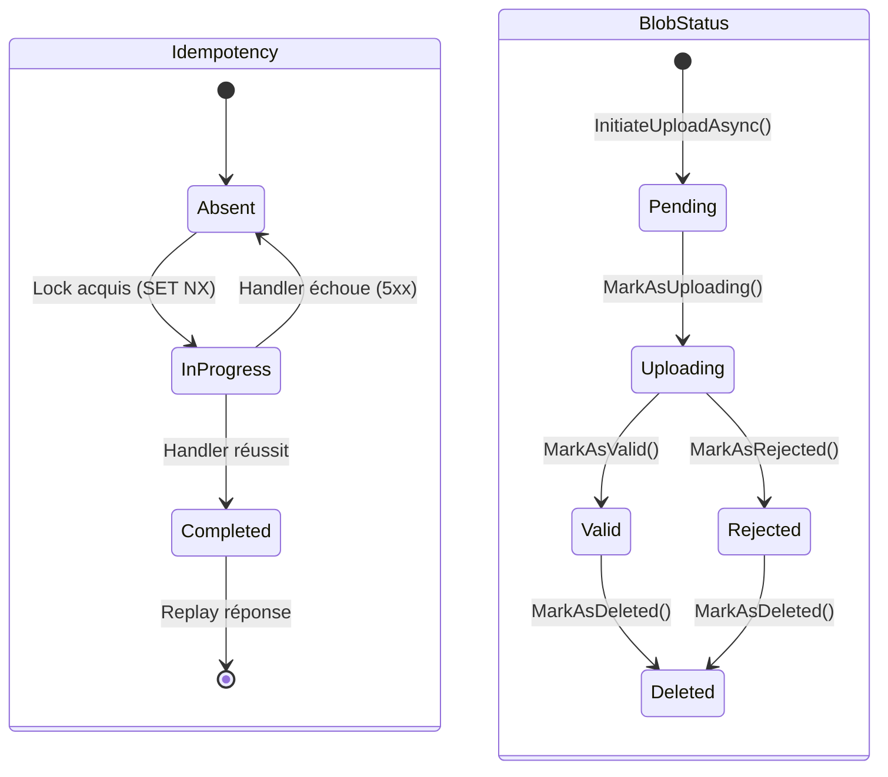

# State Machine (Machine à états)

## Définition

Le pattern State Machine modélise un objet dont le comportement change en
fonction de son état interne. Les transitions entre états sont explicites et
contrôlées, empêchant les états invalides.

Granit utilise deux machines à états : l'une pour l'idempotence HTTP, l'autre
pour le cycle de vie des blobs.

## Schéma



## Implémentation dans Granit

### IdempotencyState

| Composant | Fichier |
|-----------|---------|
| `IdempotencyState` | `src/Granit.Idempotency/Models/IdempotencyState.cs` |
| `IdempotencyMiddleware` | `src/Granit.Idempotency/Internal/IdempotencyMiddleware.cs` |

États : `Absent` → `InProgress` → `Completed`

### BlobStatus

| Composant | Fichier |
|-----------|---------|
| `BlobStatus` | `src/Granit.BlobStorage/BlobStatus.cs` |
| `BlobDescriptor` | `src/Granit.BlobStorage/BlobDescriptor.cs` |

États : `Pending` → `Uploading` → `Valid`/`Rejected` → `Deleted`

Les transitions sont encapsulées dans des méthodes sur `BlobDescriptor` :
`MarkAsUploading()`, `MarkAsValid()`, `MarkAsRejected()`, `MarkAsDeleted()`.
Chaque méthode valide l'état actuel avant la transition.

## Justification

Les machines à états rendent les transitions explicites et testables. Un blob
ne peut pas passer de `Pending` à `Deleted` directement — il doit traverser
les états intermédiaires. L'idempotence utilise les états pour gérer la
concurrence (InProgress → 409 Conflict).

## Exemple d'usage

```csharp
// Les transitions sont sécurisées par des méthodes typées
BlobDescriptor descriptor = new() { Status = BlobStatus.Pending };

descriptor.MarkAsUploading();  // Pending → Uploading ✓
descriptor.MarkAsValid();      // Uploading → Valid ✓
descriptor.MarkAsDeleted(clock.Now, "RGPD Art. 17"); // Valid → Deleted ✓

// Transition invalide → exception
descriptor.MarkAsValid(); // Deleted → Valid ✗ InvalidOperationException
```

## Pour en savoir plus

- [State — refactoring.guru](https://refactoring.guru/design-patterns/state)
