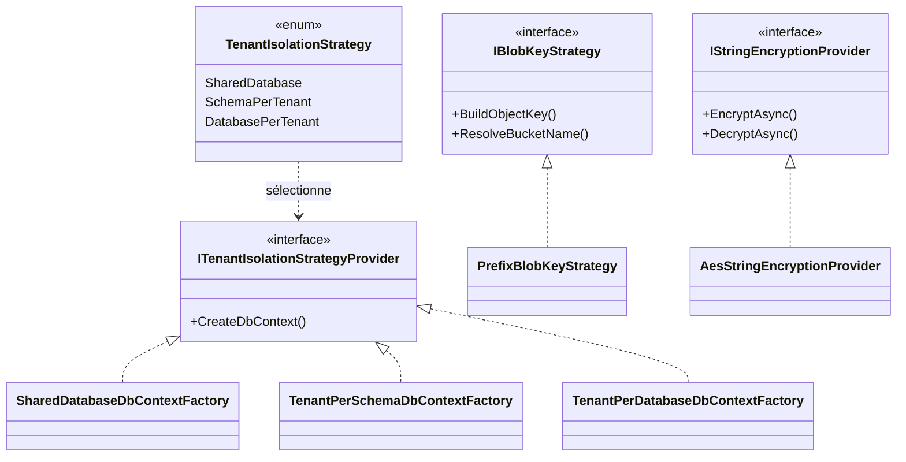

# Strategy

## Définition

Le pattern Strategy définit une famille d'algorithmes, les encapsule
chacun dans une classe distincte et les rend interchangeables. Le choix
de l'algorithme est délégué à la configuration ou au runtime.

## Schéma



## Implémentation dans Granit

| Stratégie | Interface | Fichier | Implémentations |
|-----------|-----------|---------|-----------------|
| Isolation tenant | `ITenantIsolationStrategyProvider` | `src/Granit.Persistence/MultiTenancy/` | `SharedDatabase`, `TenantPerSchema`, `TenantPerDatabase` |
| Clé S3 | `IBlobKeyStrategy` | `src/Granit.BlobStorage/IBlobKeyStrategy.cs` | `PrefixBlobKeyStrategy` |
| Chiffrement | `IStringEncryptionProvider` | `src/Granit.Encryption/Providers/` | `AesStringEncryptionProvider` |
| Résolution tenant | `ITenantResolver` | `src/Granit.MultiTenancy/Resolvers/` | `HeaderTenantResolver`, `JwtClaimTenantResolver` |

**Variante maison — Enum-based Selection** : `TenantIsolationStrategy` est un
enum qui sert de clé de sélection. La factory choisit l'implémentation via
switch expression — pas de réflexion ni de configuration complexe.

## Justification

Le choix entre SharedDatabase, SchemaPerTenant et DatabasePerTenant a des
implications majeures sur le coût, la performance et la sécurité. Le pattern
Strategy permet de changer cette décision sans modifier le code applicatif.

## Exemple d'usage

```csharp
// La stratégie est choisie via appsettings.json (section "Persistence")
// { "Persistence": { "IsolationStrategy": "SchemaPerTenant" } }
services.AddGranitPersistence();

// Le code applicatif est identique quelle que soit la stratégie
public sealed class PatientService(AppDbContext db)
{
    public async Task<Patient?> FindAsync(Guid id, CancellationToken ct)
        => await db.Patients.FindAsync([id], ct);
    // SharedDatabase → WHERE Id = @id AND TenantId = @tid
    // SchemaPerTenant → SET search_path TO tenant_xxx; SELECT ... WHERE Id = @id
    // DatabasePerTenant → Connection vers tenant_xxx_db; SELECT ... WHERE Id = @id
}
```
