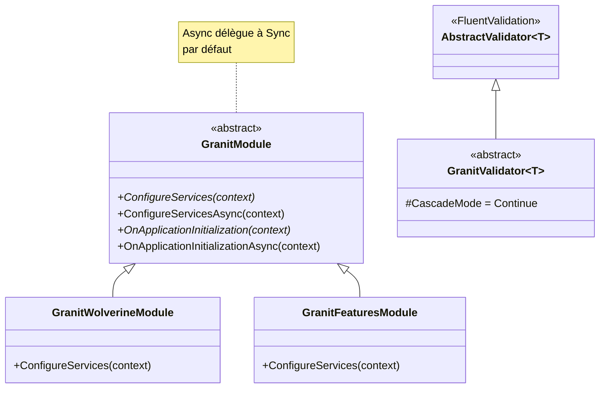

# Template Method

## Définition

Le pattern Template Method définit le squelette d'un algorithme dans une
classe de base, laissant les sous-classes redéfinir certaines étapes sans
modifier la structure globale. La classe de base appelle les méthodes dans
un ordre prédéfini ; les sous-classes surchargent celles qui les concernent.

## Schéma



## Implémentation dans Granit

| Classe de base | Fichier | Hooks |
|---------------|---------|-------|
| `GranitModule` | `src/Granit.Core/Modularity/GranitModule.cs` | `ConfigureServices()`, `ConfigureServicesAsync()`, `OnApplicationInitialization()`, `OnApplicationInitializationAsync()` |
| `GranitValidator<T>` | `src/Granit.Validation/GranitValidator.cs` | Hérite de `AbstractValidator<T>` avec `CascadeMode.Continue` par défaut |

**Variante maison — Dual Sync/Async** : `ConfigureServicesAsync()` délègue
par défaut à `ConfigureServices()`. Un module peut surcharger uniquement la
version sync ou uniquement la version async — pas d'obligation d'implémenter
les deux.

## Justification

Le cycle de vie des modules (découverte → configuration → initialisation)
est fixe. Seul le contenu de chaque étape varie entre modules. Le Template
Method garantit que l'ordre est toujours respecté.

## Exemple d'usage

```csharp
[DependsOn(typeof(GranitPersistenceModule))]
public sealed class MyAppHostModule : GranitModule
{
    // Surcharge uniquement les étapes nécessaires
    public override void ConfigureServices(ServiceConfigurationContext context)
    {
        context.Services.AddScoped<IPatientService, PatientService>();
    }

    public override void OnApplicationInitialization(ApplicationInitializationContext context)
    {
        WebApplication app = context.GetApplicationBuilder();
        app.MapControllers();
    }

    // ConfigureServicesAsync() et OnApplicationInitializationAsync()
    // ne sont pas surchargés — ils délèguent aux versions sync ci-dessus
}
```
