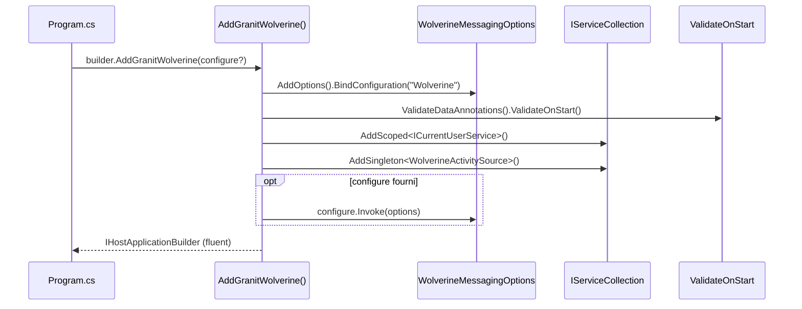

# Builder

## Définition

Le pattern Builder sépare la construction d'un objet complexe de sa
représentation, permettant de créer différentes configurations via une
interface fluide. Dans Granit, ce pattern se manifeste dans les méthodes
d'extension `AddGranit*()` qui configurent les services module par module.

## Schéma



## Implémentation dans Granit

Chaque module expose une méthode d'extension `AddGranit*()` :

| Extension | Fichier | Receveur |
|-----------|---------|----------|
| `AddGranit<TModule>()` | `src/Granit.Core/Extensions/GranitHostBuilderExtensions.cs` | `IHostApplicationBuilder` |
| `AddGranitWolverine()` | `src/Granit.Wolverine/Extensions/WolverineHostApplicationBuilderExtensions.cs` | `IHostApplicationBuilder` |
| `AddGranitBackgroundJobs()` | `src/Granit.BackgroundJobs/Extensions/BackgroundJobsHostApplicationBuilderExtensions.cs` | `IHostApplicationBuilder` |
| `AddGranitFeatures()` | `src/Granit.Features/ServiceCollectionExtensions.cs` | `IServiceCollection` |
| `AddGranitLocalization()` | `src/Granit.Localization/Extensions/LocalizationServiceCollectionExtensions.cs` | `IServiceCollection` |

**Note d'audit** : les signatures ne sont pas encore symétriques entre les
modules (voir constat C2 dans le tableau de bord critique). La cible est le
pattern `AddOptions<T>().BindConfiguration().ValidateOnStart()`.

## Justification

Le Builder permet à chaque package NuGet de s'auto-configurer sans que
l'application hôte ait à connaître les détails internes. Un seul appel
remplace des dizaines de lignes d'enregistrement DI.

## Exemple d'usage

```csharp
WebApplicationBuilder builder = WebApplication.CreateBuilder(args);

// Un seul appel par module — fluent et composable
builder.AddGranit<MyAppHostModule>();
// En interne, le ModuleLoader appelle AddGranitWolverine(),
// AddGranitPersistence(), AddGranitFeatures(), etc.
// dans l'ordre topologique des dépendances
```

## Pour en savoir plus

- [Builder — refactoring.guru](https://refactoring.guru/design-patterns/builder)
