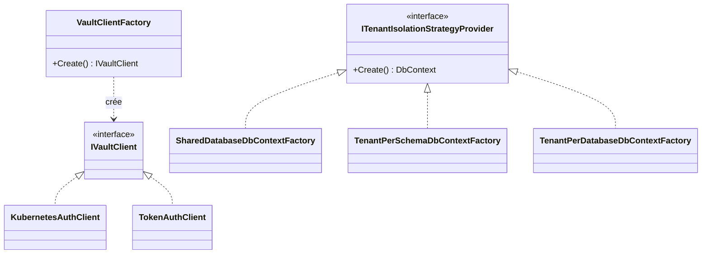

# Factory Method

## Définition

Le pattern Factory Method délègue la création d'objets à des sous-classes ou
des méthodes spécialisées, permettant de varier le type d'objet créé sans
modifier le code appelant. L'appelant travaille avec l'interface ; la factory
choisit l'implémentation concrète.

## Schéma



## Implémentation dans Granit

| Factory | Fichier | Sélection |
|---------|---------|-----------|
| `VaultClientFactory` | `src/Granit.Vault/Services/VaultClientFactory.cs` | Switch expression sur `AuthMethod` (Kubernetes / Token) |
| `SharedDatabaseDbContextFactory` | `src/Granit.Persistence/MultiTenancy/SharedDatabaseDbContextFactory.cs` | Stratégie SharedDatabase |
| `TenantPerSchemaDbContextFactory` | `src/Granit.Persistence/MultiTenancy/TenantPerSchemaDbContextFactory.cs` | Stratégie SchemaPerTenant |
| `TenantPerDatabaseDbContextFactory` | `src/Granit.Persistence/MultiTenancy/TenantPerDatabaseDbContextFactory.cs` | Stratégie DatabasePerTenant |

**Variante maison** : les factories de persistence combinent Factory Method +
Strategy — la stratégie est sélectionnée à la configuration, la factory crée
le `DbContext` approprié à chaque requête.

## Justification

Le choix de la méthode d'authentification Vault (Kubernetes en production,
Token en développement) et de la stratégie d'isolation tenant doivent être
résolus au runtime sans `if/else` dans le code applicatif.

## Exemple d'usage

```csharp
// La factory est résolue via DI — le code appelant ignore l'implémentation
IVaultClient client = vaultClientFactory.Create();
SecretData secret = await client.V1.Secrets.KeyValue.V2
    .ReadSecretAsync("app/database", cancellationToken: ct);
```

## Pour en savoir plus

- [Factory Method — refactoring.guru](https://refactoring.guru/design-patterns/factory-method)
