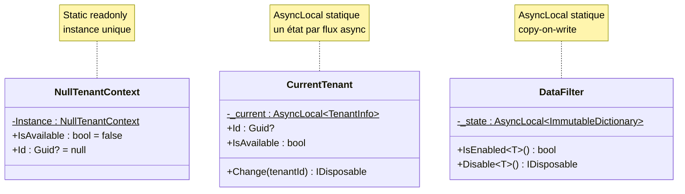

# Singleton

## Définition

Le pattern Singleton garantit qu'une classe n'a qu'une seule instance et
fournit un point d'accès global à cette instance. Dans Granit, le Singleton
prend deux formes : les singletons DI (gérés par le conteneur) et les
singletons `AsyncLocal` (état thread-safe par flux async).

## Schéma



## Implémentation dans Granit

| Singleton | Fichier | Type | Scope |
|-----------|---------|------|-------|
| `NullTenantContext.Instance` | `src/Granit.Core/MultiTenancy/NullTenantContext.cs` | `static readonly` | Global |
| `CurrentTenant._current` | `src/Granit.MultiTenancy/CurrentTenant.cs` | `AsyncLocal<TenantInfo?>` | Par flux async |
| `DataFilter._state` | `src/Granit.Core/DataFiltering/DataFilter.cs` | `AsyncLocal<ImmutableDictionary>` | Par flux async |
| Services DI | Tous les modules | `AddSingleton<T>()` | Conteneur DI |

**Variante maison — AsyncLocal Singleton** : un champ `static readonly
AsyncLocal<T>` offre un état singleton par flux `async/await`, thread-safe
sans verrou. Chaque `Task` hérite de l'état de son parent, mais les
modifications sont isolées par flux grâce au copy-on-write
(`ImmutableDictionary`).

## Justification

`NullTenantContext` élimine les vérifications `null` dans tout le framework
quand le multi-tenancy n'est pas installé. Les singletons `AsyncLocal`
permettent de propager le contexte (tenant, filtres) à travers les frontières
`async/await` sans passer par `HttpContext`.

## Exemple d'usage

```csharp
// NullTenantContext — toujours disponible, jamais null
ICurrentTenant tenant = serviceProvider.GetRequiredService<ICurrentTenant>();
// Si Granit.MultiTenancy n'est pas installé : tenant.IsAvailable == false
// Pas de NullReferenceException, pas de vérification if (tenant != null)

// AsyncLocal — état isolé par flux async
using (currentTenant.Change(newTenantId))
{
    // Ce flux async voit newTenantId
    await Task.Run(async () =>
    {
        // Ce flux enfant hérite de newTenantId
        Guid? id = currentTenant.Id; // == newTenantId
    });
}
// Ici, le tenant précédent est restauré
```
