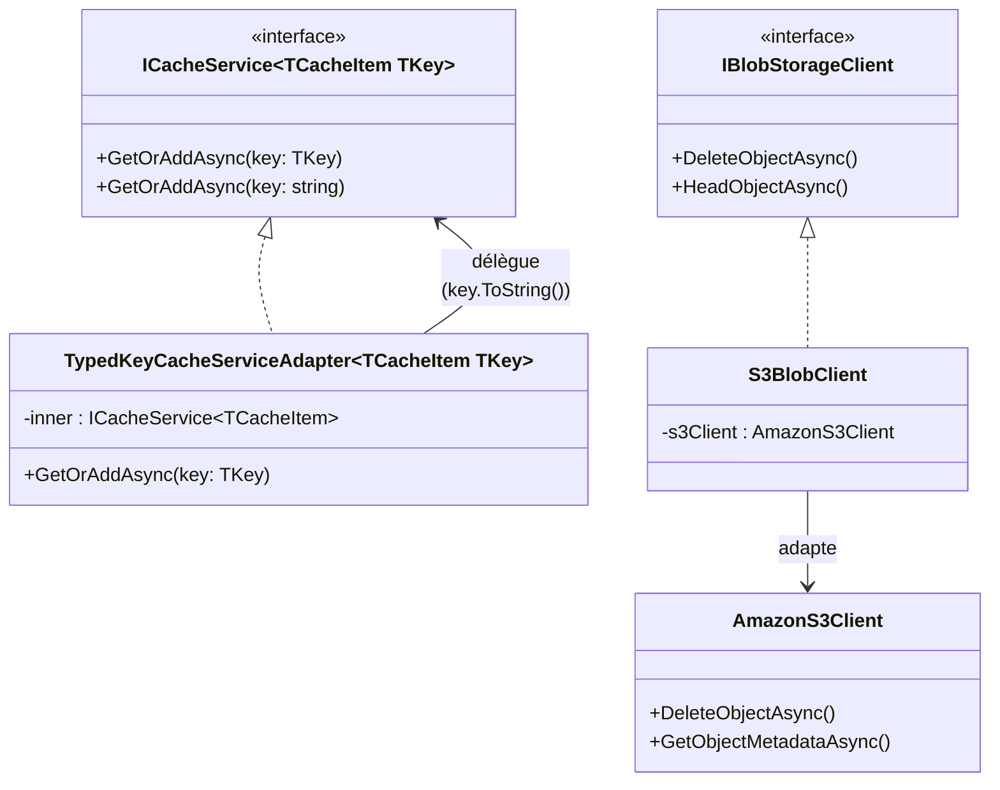

# Adapter

## Définition

Le pattern Adapter convertit l'interface d'une classe existante en une
interface attendue par le client, permettant à des composants incompatibles
de collaborer. L'adaptateur encapsule la classe existante et traduit les
appels.

## Schéma



## Implémentation dans Granit

| Adaptateur | Fichier | Interface cible | Classe adaptée |
|-----------|---------|-----------------|----------------|
| `TypedKeyCacheServiceAdapter<TCacheItem, TKey>` | `src/Granit.Caching/TypedKeyCacheServiceAdapter.cs` | `ICacheService<TCacheItem, TKey>` | `ICacheService<TCacheItem>` (clés string) |
| `S3BlobClient` | `src/Granit.BlobStorage.S3/Internal/S3BlobClient.cs` | `IBlobStorageClient` | `AmazonS3Client` (AWS SDK) |

## Justification

Le `TypedKeyCacheServiceAdapter` permet d'utiliser des clés fortement typées
(Guid, int, composite) tout en déléguant au service de cache existant basé
sur des clés string. Le `S3BlobClient` isole le framework du SDK AWS,
permettant de changer de provider S3 (OVHcloud, MinIO) sans toucher au cœur.

## Exemple d'usage

```csharp
// L'application utilise des clés typées — l'adapter convertit en string
ICacheService<PatientDto, Guid> cache = serviceProvider
    .GetRequiredService<ICacheService<PatientDto, Guid>>();

PatientDto patient = await cache.GetOrAddAsync(
    patientId, // Guid — converti en string par l'adapter
    async ct => await db.Patients.FindAsync([patientId], ct),
    cancellationToken);
```
