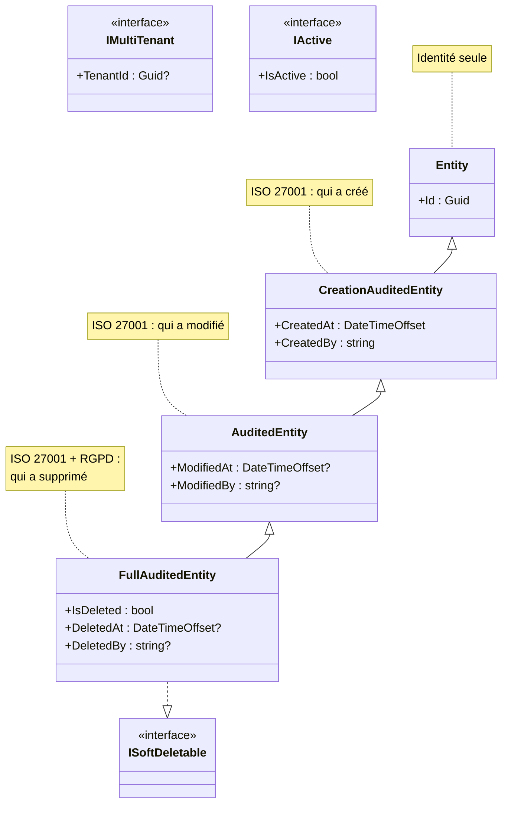

# Composite

## Définition

Le pattern Composite permet de traiter des objets individuels et des
compositions d'objets de manière uniforme. Dans Granit, ce pattern se
manifeste dans la hiérarchie d'entités auditables où chaque niveau ajoute
des capacités tout en restant manipulable de manière identique.

## Schéma



## Implémentation dans Granit

| Classe | Fichier | Capacités ajoutées |
|--------|---------|-------------------|
| `Entity` | `src/Granit.Core/Domain/Entity.cs` | `Id` (Guid) |
| `CreationAuditedEntity` | `src/Granit.Core/Domain/CreationAuditedEntity.cs` | `CreatedAt`, `CreatedBy` |
| `AuditedEntity` | `src/Granit.Core/Domain/AuditedEntity.cs` | `ModifiedAt`, `ModifiedBy` |
| `FullAuditedEntity` | `src/Granit.Core/Domain/FullAuditedEntity.cs` | `IsDeleted`, `DeletedAt`, `DeletedBy` (ISoftDeletable) |
| `ISoftDeletable` | `src/Granit.Core/Domain/ISoftDeletable.cs` | Marqueur soft delete |
| `IMultiTenant` | `src/Granit.Core/Domain/IMultiTenant.cs` | `TenantId` isolation |
| `IActive` | `src/Granit.Core/Domain/IActive.cs` | `IsActive` filtrage |

Les interfaces marqueur (`ISoftDeletable`, `IMultiTenant`, `IActive`) sont
composables avec la hiérarchie d'héritage. Les interceptors EF Core et les
query filters détectent ces interfaces par réflexion et appliquent le
comportement approprié.

## Justification

La hiérarchie progressive permet de choisir le niveau d'audit requis par
entité. Une entité de référence (code postal) n'a besoin que de `Entity`.
Une entité médicale ISO 27001 a besoin de `FullAuditedEntity` + `IMultiTenant`.
Les interceptors traitent toutes les entités uniformément.

## Exemple d'usage

```csharp
// Entité simple — identité seule
public sealed class Country : Entity { }

// Entité avec audit de création
public sealed class Invitation : CreationAuditedEntity { }

// Entité avec audit complet ISO 27001 + isolation tenant + soft delete RGPD
public sealed class MedicalRecord : FullAuditedEntity, IMultiTenant
{
    public Guid? TenantId { get; set; }
    public string Diagnosis { get; set; } = string.Empty;
}
// Les interceptors remplissent automatiquement tous les champs d'audit
```

## Pour en savoir plus

- [Composite — refactoring.guru](https://refactoring.guru/design-patterns/composite)
