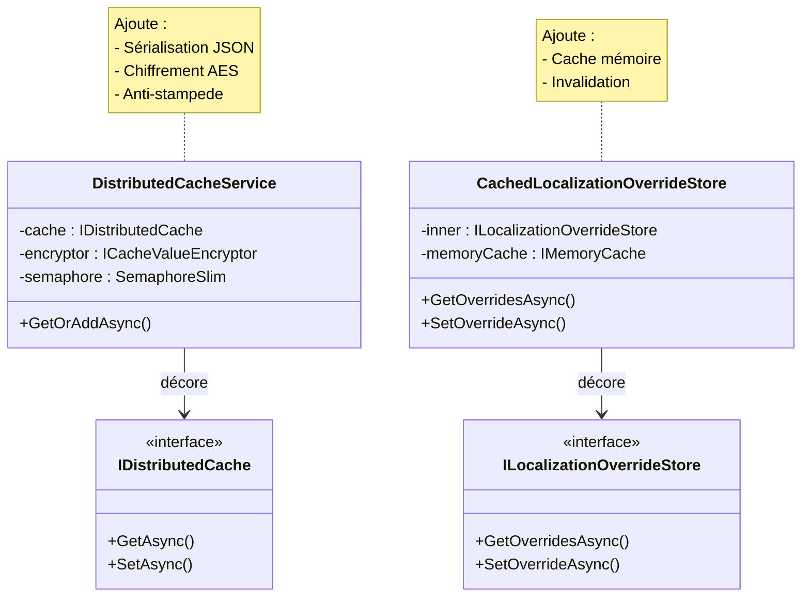

# Decorator

## Définition

Le pattern Decorator ajoute dynamiquement des responsabilités supplémentaires
à un objet sans modifier sa classe. Chaque décorateur enveloppe l'objet
d'origine et enrichit son comportement (sérialisation, chiffrement, cache,
protection anti-stampede).

## Schéma



## Implémentation dans Granit

| Décorateur | Fichier | Cible | Responsabilités ajoutées |
|-----------|---------|-------|-------------------------|
| `DistributedCacheService` | `src/Granit.Caching/DistributedCacheService.cs` | `IDistributedCache` | Sérialisation JSON, chiffrement `ICacheValueEncryptor`, double-check locking anti-stampede |
| `CachedLocalizationOverrideStore` | `src/Granit.Localization/CachedLocalizationOverrideStore.cs` | `ILocalizationOverrideStore` | Cache mémoire avec invalidation par tenant |

**Variante maison — Chiffrement conditionnel** : `DistributedCacheService`
applique le chiffrement AES-256-CBC uniquement si le type cible porte
l'attribut `[CacheEncrypted]` ou si la configuration l'exige.

## Justification

Séparer les préoccupations (sérialisation, chiffrement, anti-stampede) de la
logique de cache permet de les tester et configurer indépendamment. Le
décorateur de localisation évite de frapper la base de données à chaque
résolution de traduction.

## Exemple d'usage

```csharp
// Le consommateur utilise ICacheService<T> — le décorateur est transparent
ICacheService<PatientDto> cache = serviceProvider
    .GetRequiredService<ICacheService<PatientDto>>();

PatientDto patient = await cache.GetOrAddAsync(
    $"patient:{patientId}",
    async ct => await db.Patients.FindAsync([patientId], ct),
    cancellationToken);

// En coulisse :
// 1. Vérifie IDistributedCache (Redis)
// 2. Si miss → SemaphoreSlim (anti-stampede)
// 3. Double-check après lock
// 4. Exécute la factory
// 5. Sérialise en JSON → chiffre (si [CacheEncrypted]) → stocke dans Redis
```

## Pour en savoir plus

- [Decorator — refactoring.guru](https://refactoring.guru/design-patterns/decorator)
