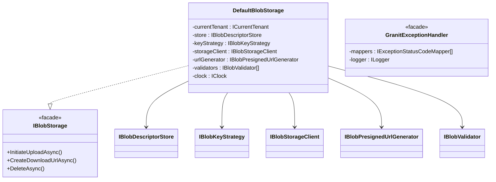

# Facade

## Définition

Le pattern Facade fournit une interface simplifiée à un sous-système complexe.
Il masque la complexité des interactions entre plusieurs composants derrière
un point d'entrée unique et cohérent.

## Schéma



## Implémentation dans Granit

| Façade | Fichier | Sous-composants orchestrés |
|--------|---------|---------------------------|
| `DefaultBlobStorage` | `src/Granit.BlobStorage/Internal/DefaultBlobStorage.cs` | `ICurrentTenant`, `IBlobDescriptorStore`, `IBlobKeyStrategy`, `IBlobStorageClient`, `IBlobPresignedUrlGenerator`, `IBlobValidator[]`, `IClock` |
| `GranitExceptionHandler` | `src/Granit.ExceptionHandling/GranitExceptionHandler.cs` | `IExceptionStatusCodeMapper[]`, `ILogger`, `ExceptionHandlingOptions` |

## Justification

Sans la façade `DefaultBlobStorage`, le code applicatif devrait orchestrer
manuellement la résolution tenant, la génération de clé S3, la création du
descripteur, la génération d'URL pré-signée et la validation — à chaque
opération. La façade encapsule cette complexité en 3 méthodes publiques.

`GranitExceptionHandler` centralise la conversion d'exceptions en
`ProblemDetails` RFC 7807, masquant la chaîne de mappers et les règles ISO 27001
(masquage des détails internes en production).

## Exemple d'usage

```csharp
// L'appelant interagit avec une API simple — la complexité est masquée
IBlobStorage blobStorage = serviceProvider.GetRequiredService<IBlobStorage>();

// Derrière cet appel : résolution tenant, création descripteur,
// génération clé S3, URL pré-signée, enregistrement en DB
PresignedUploadTicket ticket = await blobStorage.InitiateUploadAsync(
    "avatars",
    new BlobUploadRequest("photo.jpg", "image/jpeg", MaxAllowedBytes: 5_000_000),
    cancellationToken);
```

## Pour en savoir plus

- [Facade — refactoring.guru](https://refactoring.guru/design-patterns/facade)
