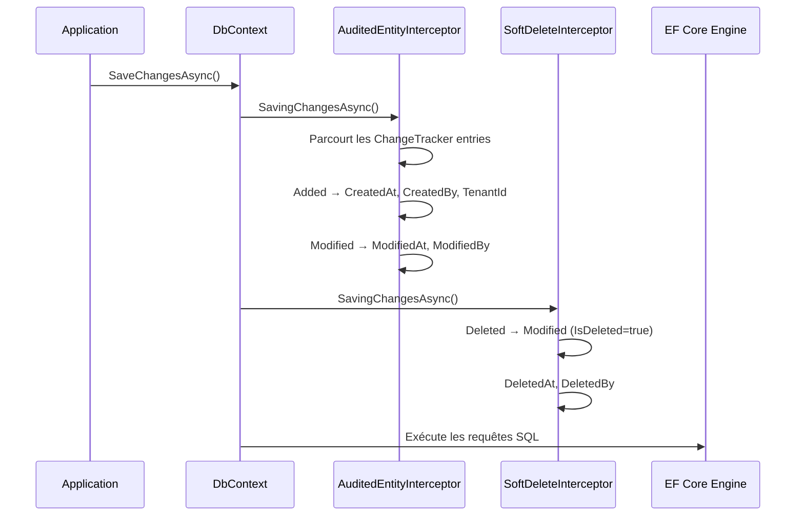

# Proxy

## Définition

Le pattern Proxy fournit un substitut ou un intermédiaire qui contrôle
l'accès à un objet. Le proxy intercepte les appels pour ajouter du
comportement (audit, filtrage, validation) de manière transparente.

Dans Granit, deux variantes du Proxy sont utilisées : le **FilterProxy** pour
les query filters EF Core, et les **Interceptors** EF Core qui interceptent
`SaveChangesAsync()`.

## Schéma



## Implémentation dans Granit

### FilterProxy (proxy de propriétés pour EF Core)

| Composant | Fichier | Rôle |
|-----------|---------|------|
| `FilterProxy` | `src/Granit.Persistence/Extensions/ModelBuilderExtensions.cs` (lignes 133-140) | Expose des propriétés booléennes (`SoftDeleteEnabled`, `ActiveEnabled`, `MultiTenantEnabled`) pour que EF Core les extraie comme paramètres de requête |

EF Core ne peut pas traduire des appels de méthode arbitraires dans les query
filters. Le `FilterProxy` contourne cette limitation en exposant des
propriétés simples que EF Core traite comme des paramètres SQL.

### Interceptors EF Core

| Interceptor | Fichier | Rôle |
|------------|---------|------|
| `AuditedEntityInterceptor` | `src/Granit.Persistence/Interceptors/AuditedEntityInterceptor.cs` | Injecte `CreatedAt/By`, `ModifiedAt/By`, `TenantId`, `Id` (séquentiel) |
| `SoftDeleteInterceptor` | `src/Granit.Persistence/Interceptors/SoftDeleteInterceptor.cs` | Convertit `DELETE` → `UPDATE` avec `IsDeleted=true`, `DeletedAt/By` |

## Justification

Les interceptors EF Core permettent d'appliquer des règles transversales
(audit ISO 27001, soft delete RGPD) de manière transparente sans polluer les
handlers applicatifs. Le `FilterProxy` résout une limitation technique
d'EF Core tout en gardant les filtres dynamiques.

## Exemple d'usage

```csharp
// L'application ne voit jamais les interceptors — ils sont transparents
Patient patient = new()
{
    FirstName = "Jean",
    LastName = "Dupont"
};

db.Patients.Add(patient);
await db.SaveChangesAsync(ct);

// L'AuditedEntityInterceptor a automatiquement renseigné :
// patient.Id = Guid séquentiel (IGuidGenerator)
// patient.CreatedAt = DateTimeOffset.UtcNow (IClock)
// patient.CreatedBy = "user-123" (ICurrentUserService)
// patient.TenantId = Guid du tenant courant (ICurrentTenant)

// La suppression est interceptée par SoftDeleteInterceptor :
db.Patients.Remove(patient);
await db.SaveChangesAsync(ct);
// → UPDATE Patients SET IsDeleted=1, DeletedAt=..., DeletedBy=... WHERE Id=...
// → Pas de DELETE physique
```
