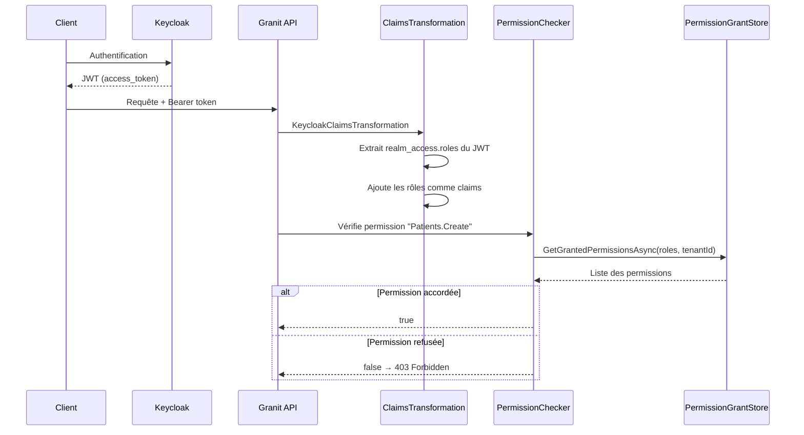

# Claims-Based Identity / RBAC

## Définition

Le pattern Claims-Based Identity représente l'identité d'un utilisateur sous
forme de claims (paires clé-valeur) extraites d'un token JWT. Le RBAC
(Role-Based Access Control) restreint l'accès en vérifiant que le rôle de
l'utilisateur possède les permissions requises.

Granit combine JWT Keycloak + RBAC strict (permissions sur rôles uniquement,
jamais par utilisateur) avec un système de policies dynamiques.

## Schéma



## Implémentation dans Granit

### Couche Authentification

| Composant | Fichier | Rôle |
| --- | --- | --- |
| `ICurrentUserService` | `src/Granit.Security/ICurrentUserService.cs` | `UserId`, `UserName`, `Email`, `GetRoles()`, `IsInRole()` |
| `KeycloakClaimsTransformation` | `src/Granit.Authentication.Keycloak/Authentication/KeycloakClaimsTransformation.cs` | Extrait `realm_access.roles` du JWT Keycloak |
| `WolverineCurrentUserService` | `src/Granit.Wolverine/Internal/WolverineCurrentUserService.cs` | Fallback `AsyncLocal` pour les handlers background |

### Couche Autorisation

| Composant | Fichier | Rôle |
| --- | --- | --- |
| `DynamicPermissionPolicyProvider` | `src/Granit.Authorization/Authorization/DynamicPermissionPolicyProvider.cs` | Crée des `AuthorizationPolicy` à la volée depuis les noms de permission |
| `PermissionChecker` | `src/Granit.Authorization/Services/PermissionChecker.cs` | Évalue les permissions contre les grants de rôles |
| `IPermissionDefinitionProvider` | `src/Granit.Authorization/Definitions/IPermissionDefinitionProvider.cs` | Déclaration des permissions (code-first) |
| `EfCorePermissionGrantStore` | `src/Granit.Authorization.EntityFrameworkCore/Stores/EfCorePermissionGrantStore.cs` | Persistence EF Core des grants |

### RBAC strict

- Les permissions sont attribuées aux **rôles**, jamais aux utilisateurs
- Le cache est par **rôle** (pas par utilisateur) pour la performance
- `AdminRoles` bootstrap les rôles avec toutes les permissions au démarrage

## Justification

| Problème | Solution |
| --- | --- |
| Keycloak renvoie les rôles dans un format custom (`realm_access`) | `KeycloakClaimsTransformation` normalise en claims standard |
| Les handlers background n'ont pas de `HttpContext` | `WolverineCurrentUserService` maintient le user via `AsyncLocal` |
| Créer une policy par permission serait explosif | `DynamicPermissionPolicyProvider` crée les policies à la demande |
| Grant par utilisateur ne passe pas à l'échelle (10K users × 100 permissions) | RBAC strict : grant sur rôles (10 rôles × 100 permissions) |

## Exemple d'usage

```csharp
// Déclarer des permissions (code-first)
public sealed class PatientPermissionDefinitionProvider : IPermissionDefinitionProvider
{
    public void DefinePermissions(IPermissionDefinitionContext context)
    {
        PermissionGroup group = context.AddGroup("Patients");
        group.AddPermission("Patients.Create");
        group.AddPermission("Patients.Read");
        group.AddPermission("Patients.Delete");
    }
}
```

> Les `displayName` localisés sont optionnels dans cet exemple simplifié. Voir la
> [documentation complète](../../framework/security/authorization.md#définir-les-permissions)
> pour l'ajout de `LocalizableString`.

```csharp

// Protéger un endpoint
app.MapPost("/api/patients", CreatePatientEndpoint.Handle)
    .RequireAuthorization("Patients.Create");

// Vérifier programmatiquement
public static class DischargePatientHandler
{
    public static async Task Handle(
        DischargePatientCommand cmd,
        IPermissionChecker permissionChecker,
        CancellationToken cancellationToken)
    {
        bool canDischarge = await permissionChecker.IsGrantedAsync("Patients.Discharge", ct);
        if (!canDischarge)
            throw new ForbiddenException();
    }
}
```

## Pour en savoir plus

- [Federated Identity pattern — Microsoft Cloud Design Patterns](https://learn.microsoft.com/en-us/azure/architecture/patterns/federated-identity)
