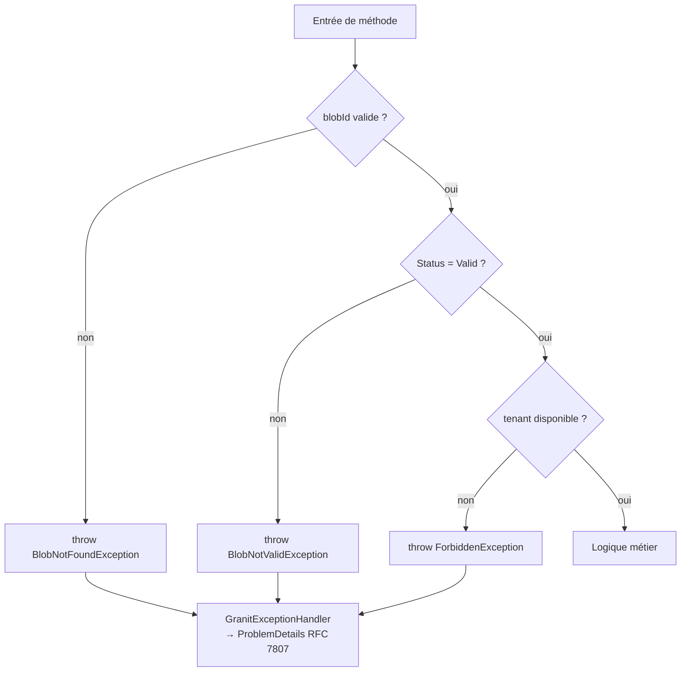

# Guard Clause (Fail-Fast)

## Définition

Le pattern Guard Clause valide les préconditions en début de méthode et
lève immédiatement une exception sémantique si une condition n'est pas
remplie. Ce pattern empêche les états invalides de se propager et produit
des messages d'erreur clairs et exploitables.

## Schéma



## Implémentation dans Granit

### Exceptions sémantiques

| Exception | Fichier | Code HTTP | ErrorCode |
|-----------|---------|-----------|-----------|
| `BusinessException` | `src/Granit.Core/Exceptions/BusinessException.cs` | 400 | Configurable |
| `NotFoundException` | `src/Granit.Core/Exceptions/NotFoundException.cs` | 404 | — |
| `EntityNotFoundException` | `src/Granit.Core/Exceptions/EntityNotFoundException.cs` | 404 | — |
| `ConflictException` | `src/Granit.Core/Exceptions/ConflictException.cs` | 409 | Configurable |
| `ForbiddenException` | `src/Granit.Core/Exceptions/ForbiddenException.cs` | 403 | — |
| `ValidationException` | `src/Granit.Core/Exceptions/ValidationException.cs` | 422 | Field errors |
| `BlobNotFoundException` | `src/Granit.BlobStorage/Exceptions/BlobNotFoundException.cs` | 404 | `BlobStorage:NotFound` |
| `FeatureLimitExceededException` | `src/Granit.Features/Exceptions/FeatureLimitExceededException.cs` | 429 | `Features:LimitExceeded` |
| `FeatureNotEnabledException` | `src/Granit.Features/Exceptions/FeatureNotEnabledException.cs` | 403 | `Features:NotEnabled` |

Toutes les exceptions sont interceptées par `GranitExceptionHandler`
(`src/Granit.ExceptionHandling/GranitExceptionHandler.cs`) et converties en
`ProblemDetails` RFC 7807.

### Règle HDS

Les exceptions qui n'implémentent pas `IUserFriendlyException` ont leur
message masqué en production (« An unexpected error occurred ») pour ne pas
fuiter le schéma interne.

## Justification

Les guard clauses rendent les préconditions explicites et documentent le
contrat de chaque méthode. Les exceptions sémantiques permettent au
middleware global de produire des réponses HTTP appropriées sans que chaque
endpoint gère ses propres erreurs.

## Exemple d'usage

```csharp
public static class DownloadDocumentHandler
{
    public static async Task<PresignedDownloadUrl> Handle(
        DownloadDocumentQuery query,
        IBlobStorage blobStorage,
        CancellationToken cancellationToken)
    {
        // Guard clause — lève BlobNotFoundException (404)
        BlobDescriptor? descriptor = await blobStorage.GetDescriptorAsync(
            "medical-documents", query.BlobId, ct)
            ?? throw new BlobNotFoundException(query.BlobId);

        // Guard clause — lève BlobNotValidException (409)
        if (descriptor.Status != BlobStatus.Valid)
            throw new BlobNotValidException(query.BlobId, descriptor.Status);

        // Logique métier — les préconditions sont garanties
        return await blobStorage.CreateDownloadUrlAsync(
            "medical-documents", query.BlobId, cancellationToken: ct);
    }
}
```
