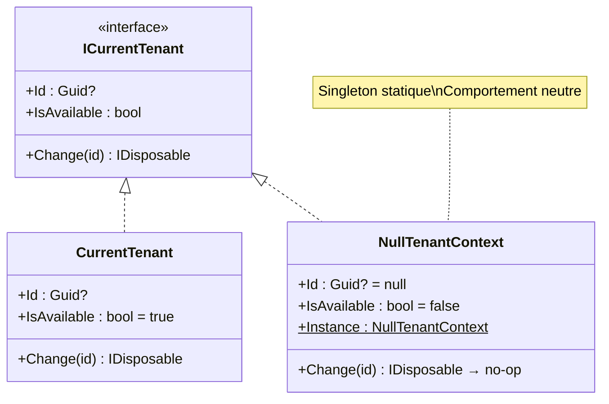

# Null Object

## Définition

Le pattern Null Object remplace les vérifications `null` par un objet qui
implémente l'interface attendue avec un comportement neutre (no-op). Le code
appelant traite l'objet Null comme n'importe quelle autre implémentation,
éliminant les branches conditionnelles.

## Schéma



## Implémentation dans Granit

| Null Object | Fichier | Interface | Comportement |
|-------------|---------|-----------|-------------|
| `NullTenantContext` | `src/Granit.Core/MultiTenancy/NullTenantContext.cs` | `ICurrentTenant` | `IsAvailable = false`, `Id = null`, `Change()` → no-op |
| `NullCacheValueEncryptor` | `src/Granit.Caching/NullCacheValueEncryptor.cs` | `ICacheValueEncryptor` | Passe les bytes sans chiffrement (dev) |
| `NullWebhookDeliveryStore` | `src/Granit.Webhooks/Internal/NullWebhookDeliveryStore.cs` | `IWebhookDeliveryStore` | Opérations no-op |

`NullTenantContext` est enregistré par défaut dans le conteneur DI. Il est
remplacé par `CurrentTenant` uniquement quand `Granit.MultiTenancy` est
installé. C'est la **soft dependency** : tous les modules peuvent injecter
`ICurrentTenant` sans dépendre de `Granit.MultiTenancy`.

## Justification

Sans le Null Object, chaque module devrait vérifier si `ICurrentTenant` est
`null` ou si le multi-tenancy est installé. Avec `NullTenantContext`, le code
vérifie simplement `IsAvailable` — jamais `null`.

## Exemple d'usage

```csharp
// Le code fonctionne identiquement avec ou sans multi-tenancy
public sealed class FeatureChecker(IServiceProvider sp)
{
    public async Task<string?> GetValueAsync(string featureName, CancellationToken cancellationToken)
    {
        ICurrentTenant? currentTenant = sp.GetService<ICurrentTenant>();

        // NullTenantContext : IsAvailable = false → tenantId = null
        // CurrentTenant : IsAvailable = true → tenantId = Guid
        Guid? tenantId = currentTenant?.IsAvailable == true
            ? currentTenant.Id
            : null;

        // Le reste du code est identique dans les deux cas
        return await ResolveFeatureValueAsync(featureName, tenantId, ct);
    }
}
```
